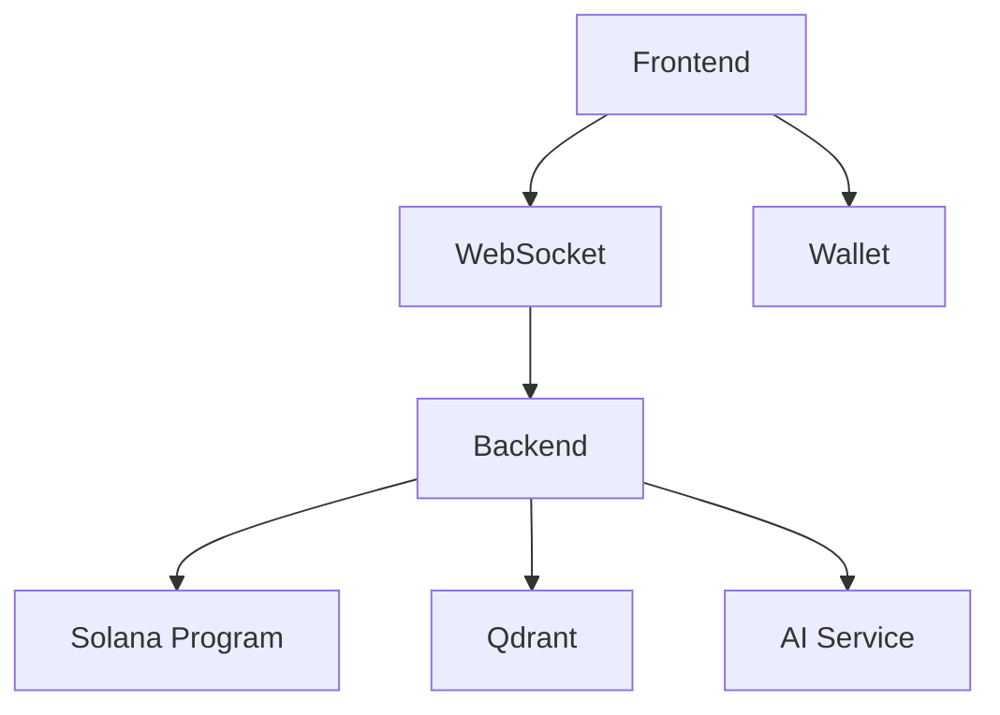

# Implementation Documentation 


==
Implementation_Dependencies
==


# Core Implementation Components

VERSION implementation_map:
  invariants: {
    "Component isolation",
    "Interface stability",
    "Protocol compatibility"
  }
  assumptions: {
    "Technology stack fixed",
    "API versioning",
    "Deployment model"
  }
  implementation: "0.1.0"

## 1. Solana Program Structure

```rust
program/
├── src/
│   ├── lib.rs              // Program entry point and instruction routing
│   ├── state/
│   │   ├── thread.rs       // Thread account structure
│   │   ├── message.rs      // Message and spec state
│   │   └── token.rs        // Token account management
│   ├── instructions/
│   │   ├── create.rs       // Thread creation
│   │   ├── submit.rs       // Message/spec submission
│   │   ├── approve.rs      // Approval processing
│   │   └── divest.rs       // Co-author divestment
│   └── error.rs            // Custom error types
├── tests/
│   ├── bankrun/            // Fast local testing
│   └── integration/        // E2E program tests
└── Cargo.toml
```

## 2. FastAPI Backend Setup

```python
api/
├── main.py                 # FastAPI application setup
├── chorus.py               # Core Chorus loop implementation
├── database.py            # Qdrant integration
├── websocket.py           # WebSocket protocol
├── models/
│   ├── thread.py          # Thread state models
│   ├── message.py         # Message models
│   └── user.py            # User session models
├── services/
│   ├── solana.py          # Solana program client
│   ├── embedding.py       # Vector embedding generation
│   └── ai.py             # AI model integration
└── config.py              # Environment configuration
```

## 3. Next.js Frontend Organization

```typescript
src/
├── components/
│   ├── StreamChat.tsx     // Main chat interface
│   ├── MessageFlow.tsx    // Message display
│   ├── ApprovalPane.tsx   // Approval UI
│   └── TokenDisplay.tsx   // Balance/stake display
├── hooks/
│   ├── useThread.ts       // Thread state management
│   ├── useWallet.ts       // Wallet integration
│   └── useWebSocket.ts    // WebSocket connection
├── state/
│   ├── thread.ts          // Thread state atoms
│   ├── message.ts         // Message state atoms
│   └── user.ts            // User state atoms
└── utils/
    ├── solana.ts          // Solana utilities
    └── websocket.ts       // WebSocket client
```

## 4. WebSocket Protocol

```typescript
TYPE WebSocketMessage = {
  type: MessageType,
  payload: {
    thread_id?: ThreadId,
    content?: string,
    hash?: Hash,
    decision?: Decision
  },
  timestamp: number,
  signature?: string
}

ENUM MessageType {
  Connect = "connect",
  Subscribe = "subscribe",
  Message = "message",
  Approval = "approval",
  StateSync = "state_sync",
  Error = "error"
}

SEQUENCE connection_flow:
  1. Initial connection
  2. Authentication
  3. Thread subscription
  4. State synchronization
  5. Real-time updates
```

## 5. Database Schema (Qdrant)

```typescript
TYPE Collection = {
  name: string,
  vectors: {
    size: number,
    distance: "Cosine"
  },
  schema: {
    content: string,
    thread_id: string,
    author: string,
    timestamp: number,
    status: "pending" | "approved" | "denied",
    metadata: {
      hash: string,
      embedding_model: string,
      privacy_level: "public" | "private"
    }
  }
}

SEQUENCE search_flow:
  1. Generate query embedding
  2. Apply privacy filters
  3. Execute vector search
  4. Post-process results
```

## Component Dependencies



## Interface Contracts

1. **Solana Program Interface**
   ```typescript
   interface ProgramInterface {
     createThread(creator: PublicKey): Promise<ThreadId>
     submitMessage(thread: ThreadId, content: string): Promise<Hash>
     processApproval(thread: ThreadId, hash: Hash, decision: boolean): Promise<void>
     divest(thread: ThreadId): Promise<TokenAmount>
   }
   ```

2. **Backend API Interface**
   ```typescript
   interface APIInterface {
     getThread(id: ThreadId): Promise<ThreadState>
     submitMessage(content: string, threadId: ThreadId): Promise<Hash>
     getMessages(threadId: ThreadId): Promise<Message[]>
     searchContent(query: string): Promise<SearchResult[]>
   }
   ```

3. **WebSocket Interface**
   ```typescript
   interface WebSocketInterface {
     connect(): Promise<void>
     subscribe(threadId: ThreadId): Promise<void>
     sendMessage(message: WebSocketMessage): Promise<void>
     onMessage(handler: (message: WebSocketMessage) => void): void
   }
   ```

## Deployment Requirements

1. **Infrastructure**
   ```yaml
   services:
     solana:
       - Program deployment
       - RPC node access
     backend:
       - FastAPI service
       - WebSocket server
     frontend:
       - Next.js static site
       - CDN distribution
     database:
       - Qdrant cluster
       - Vector storage
   ```

2. **Environment Configuration**
   ```typescript
   interface Config {
     SOLANA_RPC_URL: string
     PROGRAM_ID: PublicKey
     QDRANT_URL: string
     AI_API_KEY: string
     WS_ENDPOINT: string
   }
   ```
