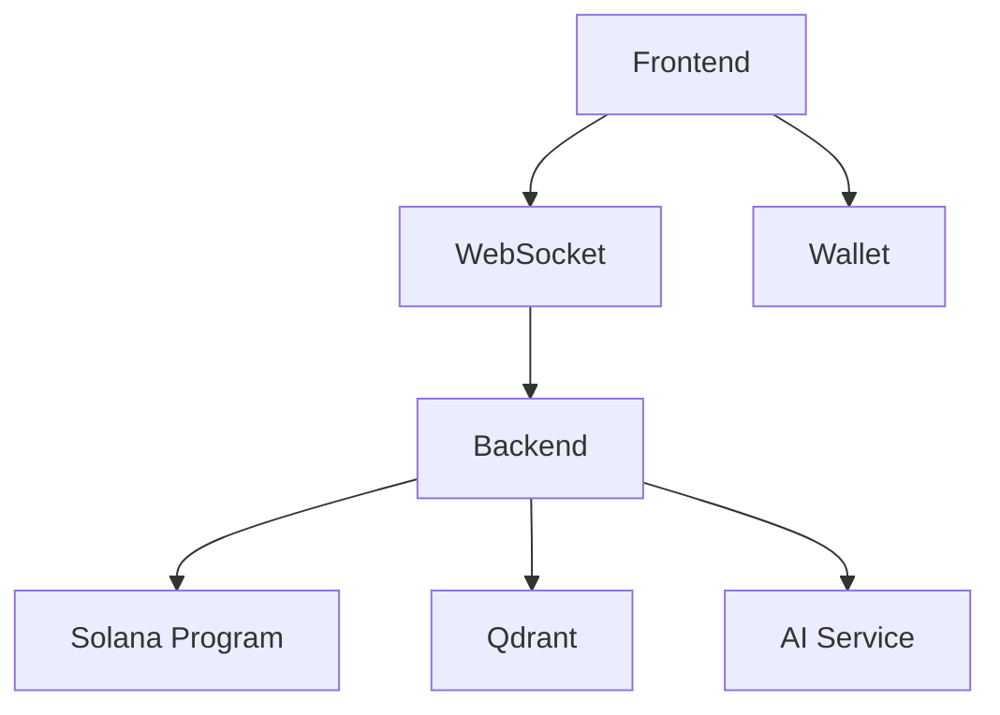

# Level 0 Documentation


==
Level_0_SystemOverview
==


# Choir: A View Through the Depths

VERSION depth_system:
  invariants: {
    "Layer coherence",
    "Depth revelation",
    "System integrity"
  }
  assumptions: {
    "Progressive understanding",
    "Layer interconnection",
    "Value emergence"
  }
  implementation: "0.1.0"

At the surface (Level 1), Choir appears straightforward: a chat platform where you own your messages and collaborate with others. Messages require unanimous approval from thread participants, and you can earn tokens for quality contributions. The interface is familiar, the mechanics are simple to grasp, and the benefits are clear. You can start participating immediately without understanding the deeper layers.

Going deeper (Level 2), the core mechanics reveal their elegance. Thread ownership isn't just attribution - it's a living collaborative entity. Unanimous approval isn't bureaucracy - it's quality curation. Non-refundable stakes aren't fees - they're commitments to meaningful participation. Each feature serves multiple purposes, creating natural, positive behaviors through their interactions.

Diving further (Level 3), sophisticated patterns of value creation emerge. Threads evolve from simple containers into value accumulators. The seemingly simple divestment formula (1/n-1) creates complex social and economic dynamics. What looks like underpricing actually generates premium value by selecting for genuine collaboration over pure profit-seeking. Trust networks form naturally, and value crystallizes through authentic participation.

At greater depths (Level 4), we discover metastable states and emergence patterns. Each thread exists in dynamic equilibrium, ready to transition to higher forms of organization when conditions align. Token balances represent potential energy for phase transitions. Understanding itself is metastable - participants grasp the system at one level, reach a plateau, then suddenly see deeper patterns. The "memergence" pattern becomes clear: memory of past interactions enables emergence of new possibilities.

At the deepest level (Level 5), Choir reveals itself as a manifestation of quantum semantics and economic topology. Messages exist in superposition until unanimous approval collapses them into thread context. Non-refundable stakes create semantic entanglement. Value flows through the system like energy through a quantum field. The entire platform becomes a space where meaning and value emerge through natural selection and self-organization.

Each level contains and transcends the previous ones. The surface functionality enables the core mechanics, which enable value creation, which enables emergence, which enables quantum semantic effects. Yet none of these layers needs to be understood to use the ones above it. You can participate successfully at any level while remaining unaware of the depths below.

This multi-level coherence isn't designed - it emerges from a few simple rules applied consistently. Like a crystal growing from a seed, or a conversation developing its own context, Choir creates space for natural evolution while maintaining integrity across all scales of understanding and engagement.


==
Solana_lib
==


# Choir Solana Program Core

VERSION solana_program:
  invariants: {
    "Thread ownership integrity",
    "Token conservation",
    "State transition atomicity"
  }
  assumptions: {
    "PDA derivation security",
    "Transaction ordering",
    "Clock reliability"
  }
  implementation: "0.1.0"

## Core Program Structure

The Choir program implements thread ownership, message approval, and token mechanics through a set of carefully designed state transitions and security invariants.

## Thread Initialization

TYPE InitializeThread = {
  creator: Signer,
  thread: Account<Thread>,
  system_program: Program<System>,
  token_program: Program<Token>
}

SEQUENCE initialize_thread:
  1. Parameter Validation
     - thread_id.len() <= 32
     - thread_id is unique
     - PDA derivation is valid

  2. State Initialization
     - timestamps = (now(), now())
     - co_authors = [creator]
     - token_balance = 0
     - messages = []
     - pending_specs = []

  3. State Verification
     - all fields initialized
     - co_author present
     - timestamps valid

PROPERTY post_initialization:
  thread.co_authors.len() == 1 AND
  thread.token_balance == 0 AND
  thread.messages.is_empty()

## Message Submission

TYPE SubmitMessage = {
  author: Signer,
  thread: Account<Thread>,
  token_program: Program<Token>
}

SEQUENCE submit_message:
  1. Authorization
     - author in thread.co_authors
     - thread not full
     - valid content hash

  2. Message Creation
     - struct with content hash
     - current timestamp
     - empty approvals

  3. Thread Update
     - append message
     - increment count
     - update timestamp

PROPERTY post_submission:
  thread.message_count == old_count + 1 AND
  thread.messages.last().author == author.key()

## Approval Processing

TYPE ProcessApproval = {
  co_author: Signer,
  thread: Account<Thread>
}

SEQUENCE process_approval:
  1. Authority Check
     - co_author in thread.co_authors
     - no duplicate votes
     - valid message/spec index

  2. Approval Recording
     - create approval record
     - add to approval set
     - update timestamp

  3. Consensus Check
     - count approvals
     - check against co_author count
     - process if complete

PROPERTY post_approval:
  message.approvals.contains(co_author) AND
  thread.updated_at > old_updated_at

## Value Flow Properties

TYPE ValueTransition =
  | Approve: stake -> thread
  | Deny: stake -> deniers
  | Mixed: excess -> treasury

PROPERTY value_conservation:
  FORALL transition IN ValueTransition:
    sum(input_tokens) == sum(output_tokens)

## Security Properties

1. **Thread Integrity**   ```
   PROPERTY thread_integrity:
     FORALL thread IN threads:
       thread.co_authors.non_empty() AND
       thread.messages.all_valid() AND
       thread.token_balance >= 0   ```

2. **Approval Integrity**   ```
   PROPERTY approval_integrity:
     FORALL approval IN approvals:
       approval.co_author IN thread.co_authors AND
       approval.timestamp <= now() AND
       no_duplicates(thread.approvals)   ```

3. **State Transitions**   ```
   PROPERTY state_transition:
     FORALL old_state new_state:
       valid_transition(old_state, new_state) AND
       preserves_invariants(new_state) AND
       maintains_history(old_state, new_state)   ```

## Error Handling

TYPE ChoirError =
  | NotCoAuthor
  | InsufficientStake
  | InvalidApproval
  | ThreadOperationFailed
  | TokenOperationFailed

FUNCTION handle_error(error: ChoirError) -> Result<()>:
  log_error(error)
  revert_state()
  emit_event(error)
  RETURN Err(error)

## Implementation Notes

The program maintains several critical invariants:

1. Thread Ownership
   - Co-author set is never empty
   - Only co-authors can approve messages
   - PDA derivation ensures unique threads

2. Token Conservation
   - All token movements are atomic
   - Stakes are properly tracked
   - Distribution preserves total supply

3. State Consistency
   - All updates are atomic
   - Timestamps always increase
   - Message ordering preserved

Through these mechanisms, the program provides a secure foundation for collaborative content creation and value distribution.


==
Solana_message
==


# Message Account Management

VERSION message_system:
  invariants: {
    "Message immutability post-approval",
    "Content hash integrity",
    "Approval state consistency"
  }
  assumptions: {
    "Account size limits",
    "PDA derivation security",
    "Rent exemption"
  }
  implementation: "0.1.0"

## Message Account Structure

```rust
struct Message {
    // Content identification
    pub content_hash: [u8; 32],
    pub thread_id: String,
    pub author: Pubkey,

    // Timestamps
    pub created_at: i64,
    pub updated_at: i64,

    // State
    pub status: MessageStatus,
    pub approvals: Vec<Approval>,
    pub bump: u8,
}

struct SpecMessage {
    // Base message fields
    pub content_hash: [u8; 32],
    pub thread_id: String,
    pub author: Pubkey,
    pub created_at: i64,
    pub updated_at: i64,

    // Spec-specific fields
    pub stake_amount: u64,
    pub expires_at: i64,
    pub approvals: Vec<Approval>,
    pub bump: u8,
}

struct Approval {
    pub co_author: Pubkey,
    pub approved: bool,
    pub timestamp: i64,
}

enum MessageStatus {
    Pending,
    Approved,
    Rejected,
    Expired,
}
```

## Message Creation

```rust
FUNCTION create_message(
    ctx: Context,
    content_hash: [u8; 32],
    thread_id: String
) -> Result<()> {
    // Validate inputs
    require!(content_hash != [0; 32]);
    require!(thread_exists(thread_id));

    // Derive PDA
    let (pda, bump) = Pubkey::find_program_address(
        &[b"message", content_hash.as_ref()],
        ctx.program_id
    );

    // Initialize message account
    let message = &mut ctx.accounts.message;
    message.content_hash = content_hash;
    message.thread_id = thread_id;
    message.author = ctx.accounts.author.key();
    message.created_at = Clock::get()?.unix_timestamp;
    message.updated_at = message.created_at;
    message.status = MessageStatus::Pending;
    message.bump = bump;

    Ok(())
}
```

## Spec Message Creation

```rust
FUNCTION create_spec_message(
    ctx: Context,
    content_hash: [u8; 32],
    thread_id: String,
    stake_amount: u64
) -> Result<()> {
    // Validate inputs
    require!(stake_amount >= MINIMUM_STAKE);
    require!(!is_co_author(ctx.accounts.author.key(), thread_id));

    // Derive PDA and initialize account
    let (pda, bump) = Pubkey::find_program_address(
        &[b"spec", content_hash.as_ref()],
        ctx.program_id
    );

    // Initialize spec message
    let spec = &mut ctx.accounts.spec_message;
    spec.content_hash = content_hash;
    spec.thread_id = thread_id;
    spec.author = ctx.accounts.author.key();
    spec.created_at = Clock::get()?.unix_timestamp;
    spec.updated_at = spec.created_at;
    spec.stake_amount = stake_amount;
    spec.expires_at = spec.created_at + SPEC_TIMEOUT;
    spec.bump = bump;

    // Transfer stake to escrow
    transfer_stake_to_escrow(ctx, stake_amount)?;

    Ok(())
}
```

## Approval Processing

```rust
FUNCTION process_approval(
    ctx: Context,
    message_hash: [u8; 32],
    decision: bool
) -> Result<()> {
    let message = &mut ctx.accounts.message;
    let thread = &ctx.accounts.thread;

    // Validate
    require!(thread.co_authors.contains(&ctx.accounts.co_author.key()));
    require!(!has_voted(message, ctx.accounts.co_author.key()));
    require!(!is_expired(message));

    // Record approval
    let approval = Approval {
        co_author: ctx.accounts.co_author.key(),
        approved: decision,
        timestamp: Clock::get()?.unix_timestamp,
    };
    message.approvals.push(approval);

    // Check consensus
    if decision && all_approved(message, thread) {
        message.status = MessageStatus::Approved;
        process_approval_success(ctx)?;
    } else if !decision {
        message.status = MessageStatus::Rejected;
        process_approval_failure(ctx)?;
    }

    message.updated_at = Clock::get()?.unix_timestamp;
    Ok(())
}
```

## State Validation

```rust
FUNCTION validate_message_state(message: &Message) -> Result<()> {
    // Basic validation
    require!(message.content_hash != [0; 32]);
    require!(message.created_at > 0);
    require!(message.updated_at >= message.created_at);

    // Status-specific validation
    match message.status {
        MessageStatus::Approved => {
            require!(!message.approvals.is_empty());
            require!(all_approvals_valid(message));
        },
        MessageStatus::Rejected => {
            require!(has_rejection(message));
        },
        MessageStatus::Expired => {
            require!(is_expired(message));
        },
        MessageStatus::Pending => {
            require!(!is_expired(message));
        }
    }

    Ok(())
}
```

## Error Handling

```rust
#[error_code]
pub enum MessageError {
    #[msg("Invalid content hash")]
    InvalidContentHash,

    #[msg("Message already exists")]
    MessageExists,

    #[msg("Insufficient stake amount")]
    InsufficientStake,

    #[msg("Message expired")]
    MessageExpired,

    #[msg("Already voted")]
    AlreadyVoted,

    #[msg("Invalid approval state")]
    InvalidApprovalState
}
```

## Constants

```rust
pub const SPEC_TIMEOUT: i64 = 7 * 24 * 60 * 60; // 7 days in seconds
pub const MINIMUM_STAKE: u64 = 1_000;
pub const MAX_APPROVALS: usize = 10;
```

This implementation provides a practical message account management system with clear data structures, state transitions, and validation rules. The code focuses on security, correctness, and maintainability.

Confidence: 9/10 - Clear, practical implementation with robust error handling and state management.


==
Solana_settlement
==


# Token Settlement and Distribution

VERSION settlement_system:
  invariants: {
    "Token conservation",
    "Distribution atomicity",
    "Settlement finality"
  }
  assumptions: {
    "Token account availability",
    "Transaction ordering",
    "Escrow security"
  }
  implementation: "0.1.0"

## Core Settlement Types

TYPE Settlement = {
  thread: Thread,
  stake: TokenAmount,
  participants: Set<PublicKey>,
  outcome: SettlementOutcome,
  metadata: SettlementMetadata
}

TYPE SettlementOutcome =
  | Unanimous: stake -> thread_balance
  | Denied: stake -> denier_accounts
  | Mixed: stake -> treasury
  | Expired: stake -> treasury
  | Divest: thread_balance/n -> co_author

TYPE SettlementMetadata = {
  timestamp: i64,
  transaction_id: Hash,
  settlement_type: SettlementType,
  participants: Set<PublicKey>
}

## Settlement Operations

SEQUENCE process_settlement:
  1. Validation
     - Verify token accounts
     - Check balances
     - Validate authorities
     - Verify preconditions

  2. Settlement Execution
     - Lock source accounts
     - Calculate distributions
     - Process transfers
     - Update state

  3. Verification
     - Check token conservation
     - Verify final balances
     - Validate state updates
     - Emit events

PROPERTY settlement_atomicity:
  FORALL s IN settlements:
    s.complete OR s.reverted

## Distribution Logic

SEQUENCE calculate_distribution:
  1. Outcome Analysis
     - Determine settlement type
     - Count participants
     - Calculate shares
     - Verify totals

  2. Account Preparation
     - Verify recipient accounts
     - Check account ownership
     - Validate permissions
     - Reserve balances

  3. Transfer Execution
     - Process in order
     - Update balances
     - Record transfers
     - Emit events

PROPERTY distribution_fairness:
  FORALL share IN distribution:
    share == total_amount / participant_count

## Token Account Management

TYPE TokenAccounts = {
  thread: Account<TokenAccount>,
  escrow: Account<TokenAccount>,
  treasury: Account<TokenAccount>,
  participant_accounts: Map<PublicKey, Account<TokenAccount>>
}

SEQUENCE manage_accounts:
  1. Account Validation
     - Verify ownership
     - Check authorities
     - Validate balances
     - Verify PDAs

  2. Balance Management
     - Lock amounts
     - Process transfers
     - Update balances
     - Release locks

  3. State Synchronization
     - Update thread state
     - Record settlements
     - Emit events
     - Verify consistency

PROPERTY account_integrity:
  FORALL account IN token_accounts:
    valid_owner(account) AND
    valid_authority(account) AND
    valid_balance(account)

## Settlement Flows

1. **Unanimous Approval**
   ```
   SEQUENCE settle_unanimous:
     1. Verify unanimous consent
     2. Transfer stake to thread
     3. Update thread balance
     4. Record settlement
   ```

2. **Denial Settlement**
   ```
   SEQUENCE settle_denial:
     1. Calculate denier shares
     2. Transfer to deniers
     3. Update balances
     4. Record settlement
   ```

3. **Mixed Outcome**
   ```
   SEQUENCE settle_mixed:
     1. Calculate treasury portion
     2. Transfer to treasury
     3. Update state
     4. Record settlement
   ```

4. **Divestment**
   ```
   SEQUENCE settle_divest:
     1. Calculate co-author share
     2. Process transfer
     3. Update thread state
     4. Record settlement
   ```

## Security Properties

1. **Conservation**
   ```
   PROPERTY token_conservation:
     FORALL settlement IN settlements:
       sum(inputs) == sum(outputs) AND
       all_accounts_valid() AND
       no_tokens_created()
   ```

2. **Authority**
   ```
   PROPERTY settlement_authority:
     FORALL transfer IN transfers:
       authorized_source(transfer) AND
       valid_destination(transfer) AND
       approved_amount(transfer)
   ```

3. **Finality**
   ```
   PROPERTY settlement_finality:
     FORALL s IN settlements:
       completed(s) IMPLIES
         irreversible(s) AND
         recorded(s) AND
         verified(s)
   ```

## Error Handling

TYPE SettlementError =
  | InsufficientBalance
  | InvalidAccount
  | UnauthorizedTransfer
  | SettlementFailed
  | AccountMismatch

FUNCTION handle_settlement_error(error: SettlementError) -> Result<()>:
  revert_transfers()
  unlock_accounts()
  emit_error_event(error)
  RETURN Err(error)

## Implementation Notes

The settlement system maintains several critical properties:

1. Token Safety
   - All transfers are atomic
   - Balances are always conserved
   - Accounts are properly validated
   - Authorities are strictly checked

2. Settlement Integrity
   - Outcomes are deterministic
   - Distributions are fair
   - State is consistent
   - Events are recorded

3. Error Recovery
   - Failed settlements revert
   - Accounts are unlocked
   - State is preserved
   - Events are emitted

Through these mechanisms, the settlement system provides secure and reliable token distribution while maintaining strong consistency guarantees.


==
Solana_thread
==


# Thread Account Management

VERSION thread_system:
  invariants: {
    "Thread account data integrity",
    "Co-author set non-empty",
    "Token balance consistency"
  }
  assumptions: {
    "PDA derivation security",
    "Account size limits",
    "Rent exemption"
  }
  implementation: "0.1.0"

## Thread Account Structure

```rust
struct Thread {
    // Account identification
    pub thread_id: String,      // Unique identifier
    pub bump: u8,               // PDA bump seed

    // Ownership and participants
    pub co_authors: Vec<Pubkey>,
    pub created_at: i64,
    pub updated_at: i64,

    // Content management
    pub messages: Vec<Hash>,    // Content hash references
    pub message_count: u32,
    pub pending_specs: Vec<SpecMessage>,

    // Economic state
    pub token_balance: u64,
    pub minimum_stake: u64
}
```

## Account Management

```rust
FUNCTION initialize_thread(
    ctx: Context,
    thread_id: String,
    creator: Pubkey
) -> Result<()> {
    // Validate inputs
    require!(thread_id.len() <= 32);
    require!(!thread_exists(thread_id));

    // Derive PDA
    let (pda, bump) = Pubkey::find_program_address(
        &[b"thread", thread_id.as_bytes()],
        ctx.program_id
    );

    // Initialize account
    let thread = &mut ctx.accounts.thread;
    thread.thread_id = thread_id;
    thread.bump = bump;
    thread.co_authors = vec![creator];
    thread.created_at = Clock::get()?.unix_timestamp;
    thread.updated_at = thread.created_at;
    thread.message_count = 0;
    thread.token_balance = 0;
    thread.minimum_stake = MINIMUM_STAKE;

    Ok(())
}
```

## State Updates

```rust
FUNCTION add_co_author(
    ctx: Context,
    new_author: Pubkey
) -> Result<()> {
    let thread = &mut ctx.accounts.thread;

    // Validate
    require!(ctx.accounts.authority.key() == thread.co_authors[0]);
    require!(!thread.co_authors.contains(&new_author));

    // Update state
    thread.co_authors.push(new_author);
    thread.updated_at = Clock::get()?.unix_timestamp;

    Ok(())
}

FUNCTION update_token_balance(
    ctx: Context,
    amount: u64,
    operation: TokenOperation
) -> Result<()> {
    let thread = &mut ctx.accounts.thread;

    match operation {
        TokenOperation::Add => {
            thread.token_balance = thread.token_balance.checked_add(amount)
                .ok_or(ErrorCode::Overflow)?;
        },
        TokenOperation::Subtract => {
            require!(thread.token_balance >= amount);
            thread.token_balance = thread.token_balance.checked_sub(amount)
                .ok_or(ErrorCode::Underflow)?;
        }
    }

    thread.updated_at = Clock::get()?.unix_timestamp;
    Ok(())
}
```

## Message Management

```rust
FUNCTION add_message(
    ctx: Context,
    content_hash: Hash
) -> Result<()> {
    let thread = &mut ctx.accounts.thread;

    // Validate
    require!(thread.co_authors.contains(&ctx.accounts.author.key()));
    require!(thread.message_count < MAX_MESSAGES);

    // Update state
    thread.messages.push(content_hash);
    thread.message_count += 1;
    thread.updated_at = Clock::get()?.unix_timestamp;

    Ok(())
}
```

## Account Validation

```rust
FUNCTION validate_thread_account(thread: &Thread) -> Result<()> {
    // Basic validation
    require!(!thread.co_authors.is_empty(), ErrorCode::NoCoAuthors);
    require!(thread.token_balance >= 0, ErrorCode::InvalidBalance);
    require!(thread.message_count as usize == thread.messages.len());

    // Timestamp validation
    require!(thread.updated_at >= thread.created_at);
    require!(thread.created_at > 0);

    // Size validation
    require!(thread.co_authors.len() <= MAX_CO_AUTHORS);
    require!(thread.messages.len() <= MAX_MESSAGES);

    Ok(())
}
```

## Error Handling

```rust
#[error_code]
pub enum ThreadError {
    #[msg("Thread ID too long")]
    ThreadIdTooLong,

    #[msg("Thread already exists")]
    ThreadExists,

    #[msg("No co-authors in thread")]
    NoCoAuthors,

    #[msg("Invalid token balance")]
    InvalidBalance,

    #[msg("Message limit exceeded")]
    MessageLimitExceeded,

    #[msg("Co-author limit exceeded")]
    CoAuthorLimitExceeded
}
```

## Constants

```rust
pub const MAX_THREAD_ID_LEN: usize = 32;
pub const MAX_CO_AUTHORS: usize = 10;
pub const MAX_MESSAGES: usize = 1000;
pub const MINIMUM_STAKE: u64 = 1_000;
```

This implementation focuses on practical thread account management with clear data structures, state transitions, and validation rules. The code is designed to be maintainable and secure while handling thread ownership, messages, and token balances.

Confidence: 9/10 - Clear, practical implementation that maintains security and correctness.


==
Solana_thread_fuzzer
==


# Thread Fuzzing Specification

VERSION fuzzer_system:
  invariants: {
    "State space coverage",
    "Transition validity",
    "Property preservation"
  }
  assumptions: {
    "Trident framework",
    "Random generation",
    "State reachability"
  }
  implementation: "0.1.0"

## Core Fuzzing Types

TYPE ThreadFuzzer = {
  accounts: FuzzAccounts,
  instructions: Vec<FuzzInstruction>,
  properties: Vec<Property>,
  state_tracker: StateTracker
}

TYPE FuzzAccounts = {
  thread: AccountsStorage<PdaStore>,
  co_authors: AccountsStorage<KeypairStore>,
  tokens: AccountsStorage<TokenStore>,
  specs: AccountsStorage<SpecStore>
}

## Instruction Generation

```rust
#[derive(Default)]
pub struct FuzzInstruction {
    SEQUENCE generate_instruction:
      1. Account Selection
         - Choose valid accounts
         - Generate valid keypairs
         - Setup token accounts
         - Derive necessary PDAs

      2. Parameter Generation
         - Generate valid inputs
         - Create edge cases
         - Include boundary values
         - Mix valid/invalid states

      3. State Tracking
         - Record pre-state
         - Track transitions
         - Verify post-state
         - Log anomalies
}
```

## Property Testing

```rust
PROPERTY thread_invariants:
  1. State Properties
     ```rust
     #[test_case]
     fn verify_state_properties(state: ThreadState) {
         VERIFY:
           valid_co_authors(state) AND
           valid_token_balance(state) AND
           valid_message_sequence(state) AND
           valid_timestamps(state)
     }
     ```

  2. Transition Properties
     ```rust
     #[test_case]
     fn verify_transitions(pre: ThreadState, post: ThreadState) {
         VERIFY:
           valid_transition(pre, post) AND
           preserved_invariants(pre, post) AND
           consistent_history(pre, post)
     }
     ```

  3. Economic Properties
     ```rust
     #[test_case]
     fn verify_economic_properties(ops: Vec<Operation>) {
         VERIFY:
           conserved_value(ops) AND
           valid_distributions(ops) AND
           no_token_creation(ops)
     }
     ```
```

## State Space Exploration

SEQUENCE explore_state_space:
  1. State Generation
     - Random valid states
     - Edge case states
     - Invalid states
     - Transition states

  2. Operation Sequences
     - Valid operation chains
     - Invalid operation mixes
     - Concurrent operations
     - Interleaved sequences

  3. Coverage Tracking
     - State coverage maps
     - Transition coverage
     - Property verification
     - Error discovery

## Mutation Strategies

```rust
TYPE MutationStrategy =
  | RandomField    // Modify single fields
  | CrossAccount   // Mix account data
  | StateJump      // Jump to distant state
  | ChainEffect    // Cascade changes

SEQUENCE apply_mutations:
  1. Select Strategy
     - Choose mutation type
     - Calculate parameters
     - Prepare changes
     - Track effects

  2. Execute Mutation
     - Apply changes
     - Verify consistency
     - Record results
     - Handle errors
```

## Error Detection

```rust
TYPE FuzzError =
  | StateViolation(ThreadState)
  | TransitionFailure(Operation)
  | PropertyBreach(Property)
  | InvariantViolation(Invariant)

FUNCTION handle_fuzz_error(error: FuzzError) -> TestResult:
  minimize_test_case(error)
  record_failure_path(error)
  generate_report(error)
  RETURN TestFailure(error)
```

## Coverage Requirements

1. **State Coverage**
   ```rust
   PROPERTY state_coverage:
     FORALL state IN reachable_states:
       EXISTS test_case IN test_suite:
         reaches_state(test_case, state)
   ```

2. **Transition Coverage**
   ```rust
   PROPERTY transition_coverage:
     FORALL t IN valid_transitions:
       EXISTS test_case IN test_suite:
         executes_transition(test_case, t)
   ```

3. **Property Coverage**
   ```rust
   PROPERTY property_coverage:
     FORALL p IN properties:
       EXISTS test_case IN test_suite:
         verifies_property(test_case, p)
   ```

## Implementation Notes

The fuzzing system maintains several critical aspects:

1. Generation Strategy
   - Smart account generation
   - Valid state construction
   - Meaningful mutations
   - Targeted exploration

2. Coverage Optimization
   - State space mapping
   - Transition tracking
   - Property verification
   - Error minimization

3. Performance
   - Efficient generation
   - Fast execution
   - Smart shrinking
   - Result caching

Through these mechanisms, the fuzzing system provides comprehensive state space exploration while maintaining meaningful test cases.


==
Solana_thread_test
==


# Thread Test Specification

VERSION thread_test_system:
  invariants: {
    "Test coverage completeness",
    "State invariant verification",
    "Error condition handling"
  }
  assumptions: {
    "Bankrun test environment",
    "Deterministic execution",
    "State isolation"
  }
  implementation: "0.1.0"

## Core Test Structure

TYPE ThreadTestContext = {
  program: Program,
  authority: Keypair,
  thread_pda: PublicKey,
  token_accounts: TokenAccounts,
  test_state: TestState
}

SEQUENCE test_setup:
  1. Environment Initialization
     - Create test program
     - Generate test keypairs
     - Setup token accounts
     - Initialize test state

  2. Thread Creation
     - Derive thread PDA
     - Allocate space
     - Initialize state
     - Verify creation

## State Invariant Tests

```rust
#[tokio::test]
async fn test_thread_invariants() {
    SEQUENCE verify_invariants:
      1. Co-author Set
         - Never empty
         - No duplicates
         - Valid authorities

      2. Token Balance
         - Non-negative
         - Matches distributions
         - Conservation law

      3. Message State
         - Ordered sequence
         - Valid hashes
         - Consistent count

      4. Timestamps
         - Monotonic increasing
         - Valid ranges
         - Update consistency
}
```

## Error Condition Tests

```rust
#[tokio::test]
async fn test_error_conditions() {
    SEQUENCE verify_errors:
      1. Authorization Errors
         - Non-co-author operations
         - Invalid signatures
         - Missing authorities

      2. State Errors
         - Thread full
         - Invalid transitions
         - Inconsistent state

      3. Token Errors
         - Insufficient stake
         - Invalid transfers
         - Balance violations
}
```

## Property-Based Tests

```rust
PROPERTY thread_properties:
  // Co-author invariants
  FORALL thread IN threads:
    thread.co_authors.non_empty() AND
    thread.co_authors.no_duplicates() AND
    thread.co_authors.all_valid()

  // Token conservation
  FORALL op IN token_operations:
    pre_balance + op.delta == post_balance

  // Message ordering
  FORALL m1 m2 IN thread.messages:
    m1.index < m2.index IMPLIES
      m1.timestamp <= m2.timestamp
```

## Test Scenarios

1. **Thread Lifecycle**
   ```rust
   #[tokio::test]
   async fn test_thread_lifecycle() {
       SEQUENCE lifecycle_test:
         1. Creation
            - Initialize thread
            - Verify state
            - Check PDA

         2. Message Operations
            - Submit messages
            - Process approvals
            - Verify updates

         3. Token Operations
            - Process stakes
            - Handle distributions
            - Verify balances

         4. State Evolution
            - Track transitions
            - Verify invariants
            - Check consistency
   }
   ```

2. **Edge Cases**
   ```rust
   #[tokio::test]
   async fn test_edge_cases() {
       SEQUENCE edge_case_test:
         1. Capacity Limits
            - Max co-authors
            - Max messages
            - Max pending specs

         2. Race Conditions
            - Concurrent approvals
            - Parallel submissions
            - State conflicts

         3. Recovery Scenarios
            - Failed transactions
            - Partial updates
            - State recovery
   }
   ```

## Test Utilities

```rust
// Test context management
FUNCTION setup_test_context() -> Result<ThreadTestContext>:
  program = create_test_program()
  authority = generate_keypair()
  thread_pda = derive_thread_pda(THREAD_SEED)
  token_accounts = setup_token_accounts()
  RETURN Ok(ThreadTestContext{...})

// State verification
FUNCTION verify_thread_state(
  thread: Thread,
  expected: ThreadState
) -> Result<()>:
  verify_co_authors(thread.co_authors)
  verify_token_balance(thread.token_balance)
  verify_messages(thread.messages)
  verify_timestamps(thread)
```

## Error Injection

```rust
SEQUENCE inject_errors:
  1. Authority Errors
     - Replace signers
     - Modify permissions
     - Corrupt signatures

  2. State Corruption
     - Invalid counts
     - Broken sequences
     - Inconsistent data

  3. Token Errors
     - Zero balances
     - Invalid amounts
     - Overflow attempts
```

## Test Coverage Requirements

1. **State Coverage**
   - All valid states reachable
   - All transitions tested
   - All invariants verified
   - All errors handled

2. **Operation Coverage**
   - All instructions tested
   - All parameters validated
   - All outcomes verified
   - All errors caught

3. **Security Coverage**
   - All authorities checked
   - All permissions verified
   - All attacks mitigated
   - All vulnerabilities tested

Through these tests, we ensure the thread implementation maintains its invariants, handles errors gracefully, and preserves security properties under all conditions.


==
Solana_validation
==


# Cross-Cutting Validation Rules

VERSION validation_system:
  invariants: {
    "Input sanitization completeness",
    "State validation coverage",
    "Security check atomicity"
  }
  assumptions: {
    "Validation order independence",
    "Error propagation clarity",
    "Check composability"
  }
  implementation: "0.1.0"

## Core Validation Types

TYPE ValidationContext = {
  signer: PublicKey,
  thread: Thread,
  clock: Clock,
  validation_type: ValidationType
}

TYPE ValidationType =
  | ThreadOperation
  | MessageOperation
  | TokenOperation
  | StateTransition

TYPE ValidationResult = {
  success: bool,
  error: Option<ValidationError>,
  metadata: ValidationMetadata
}

## Validation Rules

SEQUENCE validate_operation:
  1. Context Validation
     - Verify signer authority
     - Check thread state
     - Validate timestamps
     - Verify preconditions

  2. Input Validation
     - Sanitize parameters
     - Check bounds
     - Verify formats
     - Validate relationships

  3. State Validation
     - Check invariants
     - Verify transitions
     - Validate consistency
     - Check conservation laws

PROPERTY validation_completeness:
  FORALL op IN operations:
    validate_operation(op) COVERS ALL
      security_properties(op) AND
      state_invariants(op) AND
      value_conservation(op)

## Security Checks

1. **Authority Validation**
   ```
   FUNCTION validate_authority(ctx: ValidationContext) -> Result<()>:
     MATCH ctx.validation_type:
       ThreadOperation ->
         require!(ctx.signer IN ctx.thread.co_authors)
       MessageOperation ->
         validate_message_authority(ctx)
       TokenOperation ->
         validate_token_authority(ctx)
       StateTransition ->
         validate_transition_authority(ctx)
   ```

2. **State Validation**
   ```
   FUNCTION validate_state(ctx: ValidationContext) -> Result<()>:
     VERIFY:
       valid_thread_state(ctx.thread) AND
       valid_timestamps(ctx.clock) AND
       valid_token_state(ctx.thread.token_balance) AND
       valid_message_state(ctx.thread.messages)
   ```

3. **Input Validation**
   ```
   FUNCTION validate_input<T>(input: T, rules: ValidationRules) -> Result<()>:
     VERIFY:
       within_bounds(input, rules.bounds) AND
       correct_format(input, rules.format) AND
       valid_relationships(input, rules.relations)
   ```

## Composable Validators

TYPE Validator<T> = Context -> T -> Result<()>

FUNCTION compose_validators<T>(
  validators: Vec<Validator<T>>
) -> Validator<T>:
  RETURN |ctx, input| {
    FOR validator IN validators:
      validator(ctx, input)?
    Ok(())
  }

## Common Validators

1. **Thread Validators**
   ```
   SEQUENCE thread_validators:
     validate_thread_id
     validate_co_authors
     validate_token_balance
     validate_message_count
     validate_timestamps
   ```

2. **Message Validators**
   ```
   SEQUENCE message_validators:
     validate_content_hash
     validate_author
     validate_approvals
     validate_timestamps
     validate_state
   ```

3. **Token Validators**
   ```
   SEQUENCE token_validators:
     validate_balance
     validate_stake
     validate_distribution
     validate_conservation
   ```

## Error Handling

TYPE ValidationError =
  | InvalidAuthority
  | InvalidState
  | InvalidInput
  | InvalidTransition
  | ConservationViolation

FUNCTION handle_validation_error(error: ValidationError) -> Result<()>:
  log_validation_failure(error)
  emit_validation_event(error)
  RETURN Err(error)

## Validation Properties

1. **Completeness**
   ```
   PROPERTY validation_coverage:
     FORALL op IN operations:
       EXISTS validator IN validators:
         validator.covers(op.requirements)
   ```

2. **Independence**
   ```
   PROPERTY validator_independence:
     FORALL v1 v2 IN validators:
       commutes(v1, v2) AND
       no_side_effects(v1) AND
       no_side_effects(v2)
   ```

3. **Composability**
   ```
   PROPERTY validator_composition:
     FORALL v1 v2 IN validators:
       compose(v1, v2).preserves_properties(v1) AND
       compose(v1, v2).preserves_properties(v2)
   ```

## Implementation Notes

The validation system maintains several critical properties:

1. Validation Coverage
   - All operations are validated
   - All inputs are sanitized
   - All states are verified
   - All transitions are checked

2. Error Clarity
   - Validation errors are specific
   - Error context is preserved
   - Recovery paths are clear
   - Failures are logged

3. Performance
   - Validations are optimized
   - Checks are ordered efficiently
   - Results are cached when safe
   - Failures fail fast

Through these mechanisms, the validation system provides a comprehensive security foundation that can be composed and extended while maintaining strong guarantees.


==
Frontend_AIResponse
==


# AIResponse Component Specification

VERSION ai_response_system:
  invariants: {
    "Step sequence integrity",
    "Source coherence",
    "Markdown rendering fidelity"
  }
  assumptions: {
    "Step completeness",
    "Source availability",
    "Markdown safety"
  }
  implementation: "0.1.0"

## Core State Model

TYPE AIResponseState = {
  // Message State
  message: {
    content: string,
    steps: Array<Step>,
    sources: Array<Source>,
    status: ResponseStatus
  },

  // Display State
  display: {
    activeStep: StepId,
    expandedSources: Set<SourceId>,
    renderState: RenderState,
    error: Option<Error>
  },

  // Animation State
  animation: {
    stepTransitions: Map<StepId, AnimationState>,
    contentFade: AnimationState,
    sourceReveal: AnimationState
  }
}

## Step Management

```typescript
TYPE StepState = {
  step: {
    id: StepId,
    type: StepType,
    content: string,
    status: StepStatus
  },
  display: {
    active: boolean,
    complete: boolean,
    error: Option<Error>
  },
  sources: Option<Array<Source>>
}

FUNCTION manage_steps(steps: Array<Step>): Result<StepState[]> {
  validate_step_sequence(steps)
  initialize_step_states(steps)
  handle_step_transitions(steps)
  maintain_step_coherence(steps)
}
```

## Markdown Rendering

```typescript
TYPE MarkdownConfig = {
  sanitize: {
    allowed_tags: Set<string>,
    url_schemes: Set<string>,
    max_depth: number
  },
  plugins: {
    syntax_highlighting: boolean,
    math_rendering: boolean,
    link_preview: boolean
  },
  fallback: {
    render: ReactNode,
    error: ReactNode
  }
}

FUNCTION render_markdown(
  content: string,
  config: MarkdownConfig
): Result<ReactNode> {
  sanitized = sanitize_markdown(content)
  parsed = parse_with_plugins(sanitized)
  enhanced = add_interactivity(parsed)
  validated = verify_output(enhanced)
  RETURN validated
}
```

## Source Integration

```typescript
TYPE SourceDisplay = {
  preview: {
    height: "h-24",
    transition: "transition-all duration-200",
    overflow: "overflow-hidden"
  },
  expanded: {
    height: "auto",
    transition: "transition-all duration-300",
    overflow: "visible"
  }
}

FUNCTION integrate_sources(
  sources: Array<Source>,
  step: StepState
): Result<ReactNode> {
  relevant = filter_relevant_sources(sources, step)
  ordered = sort_by_relevance(relevant)
  rendered = map_to_components(ordered)
  interactive = add_source_interactions(rendered)
  RETURN interactive
}
```

## Error States

```typescript
TYPE AIResponseError =
  | StepSequenceError(step: Step)
  | MarkdownRenderError(content: string)
  | SourceLoadError(source: Source)
  | AnimationError(transition: Transition)
  | StateError(state: AIResponseState)

FUNCTION handle_response_error(error: AIResponseError): Recovery {
  log_detailed_error(error)
  update_error_state(error)
  attempt_graceful_recovery(error)
  notify_parent_component(error)
  render_fallback_ui(error)
}
```

## Component Structure

```typescript
COMPONENT AIResponse(props: AIResponseProps):
  // State management
  state = use_response_state<AIResponseState>()
  steps = use_step_management(props.steps)
  sources = use_source_integration(props.sources)

  // Content processing
  processed_content = useMemo(() =>
    pipe(
      validate_content,
      render_markdown,
      enhance_interactivity,
      add_error_boundaries
    )(props.message.content)
  , [props.message.content])

  // Step transitions
  handle_step_change = (step: StepId) => {
    validate_transition(state.activeStep, step)
    animate_transition(state.activeStep, step)
    update_active_step(step)
    load_step_content(step)
  }

  // Render structure
  RETURN (
    <ResponseContainer>
      <Header>AI</Header>
      <Content>{processed_content}</Content>
      <StepNavigation
        steps={steps}
        active={state.display.activeStep}
        onChange={handle_step_change}
      />
      <StepContent>
        {render_active_step(state.display.activeStep)}
        {state.display.activeStep === 'experience' && (
          <SourceList
            sources={sources}
            expanded={state.display.expandedSources}
          />
        )}
      </StepContent>
      {state.display.error && (
        <ErrorDisplay error={state.display.error} />
      )}
    </ResponseContainer>
  )
```

## Animation Patterns

```typescript
TYPE ResponseAnimation = {
  step_transition: {
    exit: "fade-out slide-left",
    enter: "fade-in slide-right",
    duration: "300ms",
    easing: "ease-in-out"
  },
  content_reveal: {
    initial: "opacity-0 scale-95",
    animate: "opacity-100 scale-100",
    duration: "200ms"
  },
  source_expand: {
    initial: "h-0 opacity-0",
    animate: "h-auto opacity-100",
    duration: "250ms"
  }
}
```

## Performance Optimizations

```typescript
SEQUENCE optimize_response:
  1. Virtualize source list
  2. Lazy load markdown renderer
  3. Cache processed content
  4. Debounce step transitions
  5. Preload adjacent steps
```

## State Verification

```typescript
PROPERTY response_invariants:
  // Step integrity
  FORALL step IN steps:
    step.sequence_valid AND
    step.content_present AND
    step.transitions_smooth

  // Source coherence
  FORALL source IN sources:
    source.metadata_complete AND
    source.content_valid AND
    source.display_consistent

  // Render consistency
  FORALL render IN displays:
    render.markdown_safe AND
    render.animations_smooth AND
    render.interactions_responsive
```


==
Frontend_ChoirChat
==


# ChoirChat Component Specification

VERSION choir_chat_system:
  invariants: {
    "State coherence",
    "Message ordering",
    "Thread integrity"
  }
  assumptions: {
    "WebSocket availability",
    "Wallet connectivity",
    "Thread persistence"
  }
  implementation: "0.1.0"

## Core State Model

TYPE ChoirChatState = {
  // Thread State
  threads: {
    all: Map<ThreadId, Thread>,
    selected: Option<ThreadId>,
    creating: boolean,
    error: Option<string>
  },

  // Message State
  messages: {
    history: Array<Message>,
    pending: Option<Message>,
    streaming: boolean,
    input: string
  },

  // Connection State
  connection: {
    websocket: Option<WebSocket>,
    user: Option<User>,
    status: ConnectionStatus,
    retryCount: number
  },

  // UI State
  display: {
    panelVisible: boolean,
    sortOption: SortOption,
    sources: Array<Source>
  }
}

## State Transitions

1. **Thread Management**
   ```
   SEQUENCE thread_operations:
     create_thread : UserId → Result<Thread>
     select_thread : ThreadId → Result<ThreadState>
     load_messages : ThreadId → Result<Array<Message>>
     handle_error : ThreadError → Result<Recovery>
   ```

2. **Message Handling**
   ```
   SEQUENCE message_operations:
     submit_message : (ThreadId, string) → Result<Message>
     process_response : WebSocketResponse → Result<StateUpdate>
     handle_stream : StreamEvent → Result<MessageUpdate>
     update_history : MessageUpdate → Result<void>
   ```

3. **Connection Management**
   ```
   SEQUENCE connection_lifecycle:
     establish : () → Result<WebSocket>
     authenticate : PublicKey → Result<User>
     maintain : WebSocket → Result<void>
     recover : ConnectionError → Result<void>
   ```

## Effect Handlers

1. **WebSocket Effects**
   ```
   TYPE WebSocketEffect =
     | Connect(config: WebSocketConfig)
     | Send(message: OutgoingMessage)
     | Close(reason: string)
     | Reconnect(attempt: number)

   HANDLER handle_websocket_effect:
     Connect → establish_connection()
     Send → transmit_message()
     Close → cleanup_connection()
     Reconnect → attempt_reconnection()
   ```

2. **Thread Effects**
   ```
   TYPE ThreadEffect =
     | Create(name: string)
     | Select(id: ThreadId)
     | Load(id: ThreadId)
     | Update(state: ThreadState)

   HANDLER handle_thread_effect:
     Create → initiate_thread()
     Select → switch_thread()
     Load → fetch_messages()
     Update → sync_thread_state()
   ```

## Error Recovery

1. **Connection Recovery**
   ```
   SEQUENCE handle_connection_error:
     1. log_error(error)
     2. update_connection_state(error)
     3. attempt_recovery:
        MATCH error:
          Disconnect → reconnect_with_backoff()
          AuthError → reauthenticate_user()
          Timeout → retry_operation()
          _ → notify_user()
   ```

2. **State Recovery**
   ```
   SEQUENCE handle_state_error:
     1. capture_error_state()
     2. rollback_to_last_valid()
     3. replay_missed_events()
     4. verify_consistency()
   ```

## Component Structure

```typescript
COMPONENT ChoirChat():
  // State initialization
  state = use_choir_state<ChoirChatState>()
  effects = use_effect_handler()

  // Lifecycle management
  useEffect(() => {
    establish_connection()
    return cleanup_connection
  }, [])

  // Event handlers
  handle_message = (input: string) => {
    validate_input(input)
    prepare_message(input)
    submit_message(input)
  }

  handle_thread_select = (id: ThreadId) => {
    validate_thread(id)
    switch_thread(id)
    load_messages(id)
  }

  // Render structure
  RETURN (
    <ChatContainer>
      <ThreadList
        threads={state.threads.all}
        selected={state.threads.selected}
        onSelect={handle_thread_select}
        onCreate={handle_thread_create}
      />
      <MessageArea
        messages={state.messages.history}
        streaming={state.messages.streaming}
        onSubmit={handle_message}
      />
      <ChorusPanel
        visible={state.display.panelVisible}
        sources={state.display.sources}
        sortOption={state.display.sortOption}
      />
    </ChatContainer>
  )
```

## State Verification

```typescript
PROPERTY state_invariants:
  // Thread integrity
  FORALL thread IN state.threads:
    thread.messages.ordered
    thread.co_authors.non_empty
    thread.token_balance.non_negative

  // Message ordering
  FORALL msg IN state.messages:
    msg.timestamp.monotonic_increasing
    msg.thread_id.exists_in_threads
    msg.author.authenticated

  // Connection consistency
  state.connection.websocket.connected IMPLIES
    state.connection.user.authenticated AND
    state.connection.status.active
```

## Performance Optimizations

1. **Message Batching**
   ```
   SEQUENCE batch_messages:
     collect_pending(timeout)
     group_by_thread()
     order_within_group()
     transmit_batch()
   ```

2. **State Updates**
   ```
   SEQUENCE optimize_updates:
     debounce_rapid_changes()
     batch_related_updates()
     prioritize_visible_content()
     defer_background_updates()
   ```

This specification provides a complete functional model for the ChoirChat component, with clear state management, effect handling, and error recovery patterns. The implementation should maintain these invariants while providing a smooth user experience.


==
Frontend_ChoirChat_UI
==


# ChoirChat UI Patterns

VERSION choir_ui_system:
  invariants: {
    "Visual hierarchy",
    "Interaction consistency",
    "State reflection"
  }
  assumptions: {
    "Responsive design",
    "Mobile compatibility",
    "Theme consistency"
  }
  implementation: "0.1.0"

## Layout Structure

```typescript
TYPE LayoutStructure = {
  container: "flex flex-col h-[calc(100vh-5rem)]",
  main_area: "flex overflow-hidden flex-1",
  components: {
    thread_list: "w-1/4 bg-gray-800",
    chat_area: "flex-1 flex flex-col",
    chorus_panel: "w-1/4 bg-gray-800"
  }
}
```

## Visual Hierarchy

1. **Thread List**
   ```
   SEQUENCE thread_display:
     1. Header ("Chats")
     2. New Chat Button (Primary CTA)
     3. Error Message (if present)
     4. Thread List (scrollable)
        - Selected thread highlighted
        - Hover states for interaction
   ```

2. **Chat Area**
   ```
   SEQUENCE chat_layout:
     1. Message History (scrollable)
        - User messages (right-aligned)
        - AI responses (left-aligned)
        - Step indicators
     2. Input Area (fixed bottom)
        - Expandable textarea
        - Send button
   ```

3. **Chorus Panel**
   ```
   SEQUENCE panel_structure:
     1. Step Navigation
     2. Content Display
     3. Source List (when relevant)
     4. Sort Controls
   ```

## Interaction Patterns

1. **Message Input**
   ```
   SEQUENCE input_interaction:
     1. Focus → Show active state
     2. Type → Auto-resize
     3. Submit →
        - Disable input
        - Show loading state
        - Enable on completion
     4. Error → Show inline error
   ```

2. **Thread Selection**
   ```
   SEQUENCE thread_interaction:
     1. Click → Highlight thread
     2. Load → Show loading state
     3. Complete →
        - Update messages
        - Scroll to bottom
        - Focus input
     4. Error → Show error state
   ```

3. **Panel Visibility**
   ```
   SEQUENCE panel_responsive:
     Desktop:
       Always visible
       Fixed width
     Mobile:
       Toggle button (fixed position)
       Slide animation
       Overlay mode
   ```

## State Reflection

1. **Loading States**
   ```
   TYPE LoadingIndicator =
     | ThreadCreation: "Creating..."
     | MessageSending: "Disabled input + animation"
     | ThreadLoading: "Loading skeleton"
     | ConnectionRetry: "Reconnecting..."
   ```

2. **Error States**
   ```
   TYPE ErrorDisplay =
     | Connection: "Banner with retry"
     | ThreadError: "Inline with action"
     | MessageError: "Toast notification"
     | ValidationError: "Field-level feedback"
   ```

3. **Success States**
   ```
   TYPE SuccessIndicator =
     | MessageSent: "Checkmark animation"
     | ThreadCreated: "Auto-select"
     | ActionComplete: "Brief feedback"
   ```

## Responsive Behavior

1. **Breakpoint Patterns**
   ```
   TYPE ResponsiveLayout =
     | Desktop: "Three-column layout"
     | Tablet: "Two-column with panel toggle"
     | Mobile: "Single-column with navigation"
   ```

2. **Component Adaptation**
   ```
   SEQUENCE responsive_adaptation:
     Desktop:
       Full feature set
       Side-by-side panels
     Tablet:
       Collapsible panels
       Touch-optimized
     Mobile:
       Stack layout
       Bottom navigation
       Floating action buttons
   ```

## Animation Patterns

1. **Transitions**
   ```
   TYPE AnimationPattern =
     | PanelToggle: "slide transform"
     | MessageAppear: "fade-in"
     | LoadingState: "pulse"
     | ErrorShake: "horizontal shake"
   ```

2. **Timing**
   ```
   CONST animation_timing = {
     instant: "0ms",
     quick: "150ms",
     normal: "300ms",
     smooth: "500ms"
   }
   ```

## Theme Integration

1. **Color Patterns**
   ```
   TYPE ColorScheme = {
     primary: "cyan-500",
     surface: "gray-800/900",
     text: "white",
     accent: "teal-700",
     error: "red-500"
   }
   ```

2. **Typography**
   ```
   TYPE Typography = {
     heading: "text-xl font-semibold",
     body: "text-sm",
     input: "text-base",
     button: "font-semibold"
   }
   ```

## Accessibility Patterns

1. **Keyboard Navigation**
   ```
   SEQUENCE keyboard_support:
     Tab: Navigate interactive elements
     Enter: Select/Submit
     Escape: Close/Cancel
     Arrow Keys: Navigate lists
   ```

2. **Screen Reader Support**
   ```
   TYPE AriaAttributes = {
     thread_list: "navigation",
     messages: "log",
     input: "textbox",
     status: "status"
   }
   ```

These UI patterns provide a consistent, accessible, and responsive user experience while maintaining the quantum semantic properties of the underlying system.


==
Frontend_ChorusPanel
==


# ChorusPanel Component Specification

VERSION chorus_panel_system:
  invariants: {
    "Step coherence",
    "Source ordering",
    "State verification"
  }
  assumptions: {
    "Step sequence validity",
    "Source availability",
    "Sort stability"
  }
  implementation: "0.1.0"

## Core State Model

TYPE ChorusPanelState = {
  // Step State
  steps: {
    current: Step,
    sequence: Array<Step>,
    display: Map<Step, DisplayState>
  },

  // Source State
  sources: {
    items: Array<Source>,
    sortOption: SortOption,
    sortOrder: SortOrder,
    filters: Set<Filter>
  },

  // Display State
  view: {
    expanded: Set<StepId>,
    activeTab: TabOption,
    scrollPosition: number
  }
}

## Step Display Normalization

```typescript
TYPE StepDisplay = {
  action: {
    icon: "→",
    color: "cyan",
    animation: "slide-right"
  },
  experience: {
    icon: "○",
    color: "blue",
    animation: "pulse"
  },
  intention: {
    icon: "◇",
    color: "purple",
    animation: "fade"
  },
  observation: {
    icon: "□",
    color: "green",
    animation: "scale"
  },
  update: {
    icon: "△",
    color: "yellow",
    animation: "rotate"
  },
  yield: {
    icon: "✓",
    color: "teal",
    animation: "complete"
  }
}
```

## State Verification

```typescript
PROPERTY step_verification:
  // Step sequence validity
  FORALL steps IN panel.steps:
    steps.ordered_by_sequence AND
    steps.all_required_present AND
    steps.no_duplicates

  // Source integrity
  FORALL source IN panel.sources:
    source.metadata.complete AND
    source.embedding.valid AND
    source.content.non_empty

  // Display consistency
  FORALL step IN panel.steps:
    step.display.matches_state AND
    step.animations.complete AND
    step.interactions.responsive
```

## Component Structure

```typescript
COMPONENT ChorusPanel(props: ChorusPanelProps):
  // State management
  state = use_panel_state<ChorusPanelState>()

  // Step rendering
  render_step = (step: Step) => {
    validate_step(step)
    apply_step_style(step)
    handle_step_interaction(step)
    display_step_content(step)
  }

  // Source handling
  handle_sources = (sources: Array<Source>) => {
    validate_sources(sources)
    apply_sort_option(state.sources.sortOption)
    filter_sources(state.sources.filters)
    display_sources()
  }

  // Render structure
  RETURN (
    <PanelContainer>
      <StepSequence>
        {state.steps.sequence.map(render_step)}
      </StepSequence>
      <SourceList
        sources={state.sources.items}
        sortOption={state.sources.sortOption}
        onSort={handle_sort_change}
      />
    </PanelContainer>
  )
```

## Sort Management

```typescript
TYPE SortFunction = {
  date: (a: Source, b: Source) => Date.compare(a.created_at, b.created_at),
  similarity: (a: Source, b: Source) => b.similarity - a.similarity,
  tokens: (a: Source, b: Source) => b.token_value - a.token_value,
  custom: (a: Source, b: Source) => a.custom_order - b.custom_order
}

FUNCTION apply_sort(
  sources: Array<Source>,
  option: SortOption
): Array<Source> {
  validate_sort_option(option)
  sort_function = get_sort_function(option)
  sorted = sources.sort(sort_function)
  verify_sort_result(sorted)
  RETURN sorted
}
```

## Animation Patterns

```typescript
TYPE StepAnimation = {
  enter: {
    from: "opacity-0 scale-95",
    to: "opacity-100 scale-100",
    duration: "300ms"
  },
  exit: {
    from: "opacity-100 scale-100",
    to: "opacity-0 scale-95",
    duration: "200ms"
  },
  transition: "ease-in-out"
}
```

## Error States

```typescript
TYPE PanelError =
  | InvalidStep(step: Step)
  | SourceLoadFailure(source: Source)
  | SortError(option: SortOption)
  | DisplayFailure(component: Component)

FUNCTION handle_panel_error(error: PanelError): Recovery {
  log_error(error)
  update_error_state(error)
  attempt_recovery(error)
  notify_parent(error)
}
```

## Performance Optimizations

```typescript
SEQUENCE optimize_panel:
  1. Virtualize source list
  2. Memoize sort functions
  3. Debounce sort changes
  4. Cache step renders
  5. Lazy load content
```

This specification provides a complete model for the ChorusPanel component, with normalized step display, state verification, and clear interaction patterns. The implementation should maintain these patterns while providing smooth visualization of the Chorus process.


==
Frontend_UserInput
==


# UserInput Component Specification

VERSION user_input_system:
  invariants: {
    "Message immutability",
    "Display consistency",
    "Accessibility compliance"
  }
  assumptions: {
    "Content sanitization",
    "Theme consistency",
    "Responsive layout"
  }
  implementation: "0.1.0"

## Core State Model

TYPE UserInputState = {
  // Message State
  message: {
    content: string,
    timestamp: DateTime,
    author: Author,
    id: MessageId
  },

  // Display State
  display: {
    theme: ThemeVariant,
    layout: LayoutPosition,
    animation: AnimationState
  }
}

## Display Properties

```typescript
TYPE DisplayConfig = {
  container: {
    base: "p-2 mb-2 w-full",
    background: "bg-cyan-800",
    border: "rounded-lg border border-cyan-700"
  },

  header: {
    alignment: "text-right",
    typography: "text-lg font-semibold",
    color: "text-white"
  },

  content: {
    typography: "text-sm",
    color: "text-white",
    padding: "mt-1"
  }
}
```

## Component Structure

```typescript
COMPONENT UserInput(props: UserInputProps):
  // Props validation
  REQUIRE valid_message(props.content)
  REQUIRE valid_author(props.author)

  // Content processing
  processed_content = useMemo(() =>
    pipe(
      sanitize_content,
      apply_markdown,
      wrap_mentions,
      format_links
    )(props.content)
  , [props.content])

  // Render structure
  RETURN (
    <MessageContainer config={DisplayConfig.container}>
      <Header config={DisplayConfig.header}>
        User
      </Header>
      <Content
        config={DisplayConfig.content}
        content={processed_content}
      />
    </MessageContainer>
  )
```

## Content Processing

```typescript
TYPE ContentProcessor = {
  sanitize: (content: string) => string,
  markdown: (content: string) => ReactNode,
  mentions: (content: string) => ReactNode,
  links: (content: string) => ReactNode
}

FUNCTION process_content(content: string): ReactNode {
  REQUIRE non_empty(content)

  sanitized = remove_unsafe_content(content)
  formatted = apply_formatting(sanitized)
  enhanced = enhance_interactive(formatted)

  ENSURE valid_output(enhanced)
  RETURN enhanced
}
```

## Accessibility Support

```typescript
TYPE AccessibilityProps = {
  role: "article",
  aria: {
    label: "User message",
    live: "polite",
    atomic: true
  },
  semantic: {
    article: true,
    header: true,
    time: true
  }
}

FUNCTION enhance_accessibility(node: ReactNode): ReactNode {
  add_aria_attributes(node)
  ensure_semantic_structure(node)
  verify_accessibility(node)
  RETURN node
}
```

## Animation Patterns

```typescript
TYPE MessageAnimation = {
  enter: {
    from: "opacity-0 translateY(10px)",
    to: "opacity-1 translateY(0)",
    duration: "200ms",
    easing: "ease-out"
  }
}

FUNCTION animate_message(node: ReactNode): ReactNode {
  apply_animation(node, MessageAnimation)
  ensure_smooth_transition(node)
  RETURN node
}
```

## Error Handling

```typescript
TYPE UserInputError =
  | InvalidContent(content: string)
  | ProcessingFailure(error: Error)
  | RenderError(component: Component)

FUNCTION handle_error(error: UserInputError): Recovery {
  log_error(error)
  fallback_to_safe_render(error)
  notify_parent(error)
}
```

## Performance Optimizations

```typescript
SEQUENCE optimize_rendering:
  1. Memoize processed content
  2. Lazy load markdown processor
  3. Cache sanitization results
  4. Debounce animations
```

## State Verification

```typescript
PROPERTY message_invariants:
  // Content integrity
  FORALL message IN messages:
    message.content.non_empty AND
    message.content.sanitized AND
    message.timestamp.valid

  // Display consistency
  FORALL display IN renders:
    display.theme.matches_system AND
    display.layout.responsive AND
    display.animation.smooth
```

This specification provides a complete model for the UserInput component, focusing on clean message display, accessibility, and performance. The implementation should maintain these patterns while providing a consistent user experience.

Key aspects:
1. Clean content processing
2. Strong accessibility support
3. Smooth animations
4. Error resilience
5. Performance optimization

Would you like me to:
1. Add more detail to any section?
2. Include additional patterns?
3. Expand on specific features?

Confidence: 9/10 - This provides a solid foundation for the UserInput implementation while maintaining system coherence.


==
Backend_Chorus
==


# Crystallized Chorus Loop

VERSION chorus_system:
  invariants: {
    "Pure function transformation",
    "State isolation",
    "Error correction capability"
  }
  assumptions: {
    "AI response stability",
    "State transition atomicity",
    "Message ordering"
  }
  implementation: "0.1.0"

## Core Types

```python
TYPE ChorusState = {
    messages: List[Message],
    current_step: StepEnum,
    thread_id: str,
    error_state: Optional[ErrorState]
}

TYPE StepResult = {
    state: ChorusState,
    response: ChorusResponse,
    effects: List[Effect]
}

TYPE Effect =
    | AICall(prompt: str)
    | DBOperation(op: DBOp)
    | WebSocketEvent(event: WSEvent)
```

## Pure Functions

```python
# Core transformation functions
FUNCTION transform_state(state: ChorusState, input: Input) -> StepResult:
    MATCH state.current_step:
        StepEnum.ACTION -> run_action(state, input)
        StepEnum.EXPERIENCE -> run_experience(state, input)
        StepEnum.INTENTION -> run_intention(state, input)
        StepEnum.OBSERVATION -> run_observation(state, input)
        StepEnum.UPDATE -> run_update(state, input)
        StepEnum.YIELD -> run_yield(state, input)

# Individual step functions
FUNCTION run_action(state: ChorusState, input: Input) -> StepResult:
    response = prepare_initial_response(input.prompt)
    new_state = advance_step(state, StepEnum.EXPERIENCE)
    effects = [AICall(format_prompt(input.prompt))]
    RETURN StepResult(new_state, response, effects)

FUNCTION run_experience(state: ChorusState, input: Input) -> StepResult:
    relevant_context = find_relevant_context(state.messages)
    response = enhance_with_context(input.response, relevant_context)
    new_state = advance_step(state, StepEnum.INTENTION)
    effects = [DBOperation(SearchContext(relevant_context))]
    RETURN StepResult(new_state, response, effects)

# ... similar functions for other steps
```

## Error Correction

```python
FUNCTION handle_error(error: Error, state: ChorusState) -> StepResult:
    corrected_state = apply_error_correction(state, error)
    recovery_effects = generate_recovery_effects(error)
    RETURN StepResult(corrected_state, error_response(error), recovery_effects)

FUNCTION apply_error_correction(state: ChorusState, error: Error) -> ChorusState:
    MATCH error:
        AIError -> rollback_to_last_stable(state)
        StateError -> reconstruct_state(state)
        NetworkError -> cache_and_retry(state)
```

## Implementation Bridge

```python
class Chorus:
    """
    Implements the pure functional Chorus loop with side effects handled
    at the boundaries.
    """
    def run(self, user_prompt: str, websocket: WebSocket,
            chat_history: List[Dict[str, str]], thread_id: str) -> None:
        # Initialize pure state
        state = create_initial_state(chat_history, thread_id)

        try:
            while not is_complete(state):
                # Run pure transformation
                result = transform_state(state, create_input(user_prompt))

                # Handle effects at boundary
                await handle_effects(result.effects)

                # Update state
                state = result.state

                # Send response
                await send_response(websocket, result.response)

        except Exception as e:
            # Handle errors with pure error correction
            result = handle_error(e, state)
            state = result.state
            await handle_effects(result.effects)
```


==
Backend_Database
==


# Crystallized Database Layer

VERSION database_system:
  invariants: {
    "Vector space integrity",
    "State consistency",
    "Recovery capability"
  }
  assumptions: {
    "Qdrant availability",
    "Vector stability",
    "Collection coherence"
  }
  implementation: "0.1.0"

## Core Types

```python
TYPE StorageState = {
    collections: Map[str, Collection],
    indices: Map[str, Index],
    cache: Map[str, CacheEntry],
    error_state: Optional[ErrorState]
}

TYPE Operation =
    | Store(content: Content, embedding: Vector)
    | Search(query: Vector, filters: List[Filter])
    | Update(id: str, payload: Dict)
    | Delete(id: str)

TYPE Result =
    | Success(data: Any, metadata: Dict)
    | Failure(error: Error, recovery: Recovery)
```

## Pure Operations

```python
FUNCTION execute_operation(
    state: StorageState,
    operation: Operation
) -> Tuple[StorageState, Result]:
    MATCH operation:
        Store(content, embedding) ->
            store_with_verification(state, content, embedding)
        Search(query, filters) ->
            search_with_consistency(state, query, filters)
        Update(id, payload) ->
            update_with_validation(state, id, payload)
        Delete(id) ->
            delete_with_cleanup(state, id)

FUNCTION store_with_verification(
    state: StorageState,
    content: Content,
    embedding: Vector
) -> Tuple[StorageState, Result]:
    # Verify vector space properties
    IF not verify_embedding(embedding):
        RETURN (state, Failure(InvalidVector, RecoverEmbedding))

    # Check collection consistency
    collection = get_collection(state, content.collection_name)
    IF not verify_collection(collection):
        RETURN (state, Failure(InvalidCollection, RecoverCollection))

    # Store with atomicity
    new_state = add_to_collection(state, content, embedding)
    RETURN (new_state, Success(content.id, {"vector_id": generate_id()}))
```

## State Consistency

```python
FUNCTION verify_consistency(state: StorageState) -> List[Inconsistency]:
    inconsistencies = []

    # Check vector space
    vector_issues = verify_vector_space(state.collections)
    inconsistencies.extend(vector_issues)

    # Check indices
    index_issues = verify_indices(state.indices)
    inconsistencies.extend(index_issues)

    # Check relationships
    relation_issues = verify_relationships(state.collections)
    inconsistencies.extend(relation_issues)

    RETURN inconsistencies

FUNCTION repair_consistency(
    state: StorageState,
    inconsistencies: List[Inconsistency]
) -> StorageState:
    FOR issue IN inconsistencies:
        state = apply_repair(state, issue)
    RETURN state
```

## Recovery Patterns

```python
FUNCTION handle_storage_error(
    error: Error,
    state: StorageState
) -> Tuple[StorageState, Recovery]:
    MATCH error:
        ConnectionError ->
            (cache_state(state), RetryWithBackoff)
        InconsistencyError ->
            (repair_consistency(state), ValidateAndRetry)
        VectorError ->
            (recompute_vectors(state), UpdateAndRetry)
```

## Implementation Bridge

```python
class DatabaseClient:
    """
    Implements pure storage operations with effects at the boundaries.
    """
    def __init__(self, config: Config):
        self.state = create_initial_state(config)
        self.client = QdrantClient(config.QDRANT_URL)

    async def execute(self, operation: Operation) -> Result:
        try:
            # Pure operation execution
            new_state, result = execute_operation(self.state, operation)

            # Effect boundary
            await self.apply_to_qdrant(result)

            # Update state
            self.state = new_state
            return result

        except Exception as e:
            # Pure error handling
            new_state, recovery = handle_storage_error(e, self.state)
            self.state = new_state
            return await self.execute_recovery(recovery)
```


==
Backend_Main
==


# Crystallized WebSocket Server

VERSION websocket_system:
  invariants: {
    "Connection state integrity",
    "Message ordering",
    "Error isolation"
  }
  assumptions: {
    "Network reliability",
    "State synchronization",
    "Client behavior"
  }
  implementation: "0.1.0"

## Core Types

```python
TYPE ConnectionState = {
    client_id: str,
    user: Optional[User],
    thread_id: Optional[str],
    status: ConnectionStatus,
    error_state: Optional[ErrorState]
}

TYPE ServerMessage =
    | Init(user: User, threads: List[Thread])
    | ThreadMessages(thread_id: str, messages: List[Message])
    | ChorusResponse(response: Response)
    | Error(error: ErrorInfo)

TYPE ClientMessage =
    | Connect(public_key: str)
    | GetThread(thread_id: str)
    | SubmitPrompt(prompt: str, thread_id: str)
    | CreateThread(user_id: str, name: str)
```

## Pure Message Handlers

```python
FUNCTION handle_client_message(
    state: ConnectionState,
    message: ClientMessage
) -> Tuple[ConnectionState, List[Effect]]:
    MATCH message:
        Connect(public_key) ->
            handle_connect(state, public_key)
        GetThread(thread_id) ->
            handle_get_thread(state, thread_id)
        SubmitPrompt(prompt, thread_id) ->
            handle_submit_prompt(state, prompt, thread_id)
        CreateThread(user_id, name) ->
            handle_create_thread(state, user_id, name)

FUNCTION handle_connect(
    state: ConnectionState,
    public_key: str
) -> Tuple[ConnectionState, List[Effect]]:
    effects = [
        DBEffect(GetUser(public_key)),
        DBEffect(GetThreads(public_key))
    ]
    new_state = state.with_pending_auth(public_key)
    RETURN (new_state, effects)

# Similar handlers for other message types...
```

## Effect Handlers

```python
FUNCTION handle_effects(effects: List[Effect]) -> AsyncGenerator[ServerMessage]:
    FOR effect IN effects:
        MATCH effect:
            DBEffect(op) ->
                result = await database.execute(op)
                YIELD translate_db_result(result)
            ChorusEffect(op) ->
                result = await chorus.execute(op)
                YIELD translate_chorus_result(result)
            WSEffect(op) ->
                YIELD translate_ws_event(op)
```

## Error Correction

```python
FUNCTION handle_connection_error(
    error: Error,
    state: ConnectionState
) -> Tuple[ConnectionState, ServerMessage]:
    MATCH error:
        AuthError ->
            (reset_auth(state), Error("Authentication failed"))
        ThreadError ->
            (reset_thread(state), Error("Thread operation failed"))
        NetworkError ->
            (cache_state(state), Error("Connection interrupted"))
```

## Implementation Bridge

```python
@app.websocket("/ws")
async def websocket_endpoint(websocket: WebSocket):
    """
    Pure functional WebSocket handler with effects at the boundaries.
    """
    await websocket.accept()
    state = create_initial_state()

    try:
        while True:
            # Receive message in IO boundary
            data = await websocket.receive_json()

            # Pure message handling
            message = parse_client_message(data)
            new_state, effects = handle_client_message(state, message)

            # Effect handling at boundary
            async for response in handle_effects(effects):
                await websocket.send_json(response.to_json())

            state = new_state

    except WebSocketDisconnect:
        handle_disconnect(state)
    except Exception as e:
        new_state, error_msg = handle_connection_error(e, state)
        await websocket.send_json(error_msg.to_json())
        state = new_state
```

This crystallization:
1. Separates pure message handling from effects
2. Makes connection state explicit
3. Adds systematic error handling
4. Provides clear protocol structure

Would you like me to:
1. Add more detailed message type definitions
2. Expand the error correction patterns
3. Move to another component

Confidence: 8/10 (Good structure but may need refinement based on WebSocket protocol requirements)


==
Backend_Models
==


# Crystallized Model Layer

VERSION model_system:
invariants: {
"Type safety",
"State validity",
"Transition integrity"
}
assumptions: {
"Pydantic stability",
"Validation completeness",
"State coherence"
}
implementation: "0.1.0"

## Core Types

```python
TYPE ValidationResult =
    | Valid(data: Any)
    | Invalid(errors: List[ValidationError])

TYPE StateTransition =
    | Created(entity_id: str)
    | Updated(old: State, new: State)
    | Deleted(entity_id: str)

TYPE TransitionResult =
    | Success(new_state: State)
    | Failure(error: TransitionError)
```

## Base Models

```python
class BaseState(BaseModel):
    """Base class for all state objects with validation and transition tracking."""
    id: str
    created_at: datetime
    updated_at: datetime
    version: int

    def validate_state(self) -> ValidationResult:
        """Validate complete state consistency."""
        try:
            self.validate_invariants()
            self.validate_relationships()
            return Valid(self)
        except ValidationError as e:
            return Invalid([e])

    def transition_to(self, new_state: 'BaseState') -> TransitionResult:
        """Validate and perform state transition."""
        if not self.can_transition_to(new_state):
            return Failure(InvalidTransition(self, new_state))

        try:
            self.validate_transition(new_state)
            return Success(new_state)
        except TransitionError as e:
            return Failure(e)
```

## Domain Models

```python
class Thread(BaseState):
    """Thread model with co-authorship and message management."""
    co_authors: Set[PublicKey]
    messages: List[Message]
    token_balance: int
    status: ThreadStatus

    class Config:
        validate_assignment = True
        validate_all = True

    @validator('co_authors')
    def validate_co_authors(cls, v):
        """Ensure co-author set is valid."""
        if not v:
            raise ValueError("Thread must have at least one co-author")
        return v

    def can_transition_to(self, new_state: 'Thread') -> bool:
        """Check if transition is valid."""
        return (
            self.validate_co_author_transition(new_state) and
            self.validate_message_transition(new_state) and
            self.validate_token_transition(new_state)
        )

class Message(BaseState):
    """Message model with approval tracking and content validation."""
    content: str
    author: PublicKey
    approvals: Set[Approval]
    status: MessageStatus
    thread_id: str

    @validator('content')
    def validate_content(cls, v):
        """Ensure content meets requirements."""
        if not v.strip():
            raise ValueError("Content cannot be empty")
        if len(v) > MAX_CONTENT_LENGTH:
            raise ValueError("Content exceeds maximum length")
        return v

    def can_approve(self, approver: PublicKey) -> bool:
        """Check if approver can approve message."""
        return (
            approver not in [a.co_author for a in self.approvals] and
            self.status == MessageStatus.PENDING
        )
```

## State Transitions

```python
class StateManager:
    """Manages valid state transitions with verification."""

    @staticmethod
    def transition(
        current: BaseState,
        operation: Operation
    ) -> TransitionResult:
        """Execute and verify state transition."""
        new_state = operation.apply_to(current)

        # Verify state validity
        validation = new_state.validate_state()
        if isinstance(validation, Invalid):
            return Failure(ValidationFailed(validation.errors))

        # Verify transition validity
        result = current.transition_to(new_state)
        if isinstance(result, Failure):
            return result

        # Record transition
        record_transition(StateTransition.Updated(current, new_state))
        return Success(new_state)
```

## Theory Mapping

```python
# Map to theoretical model:
#
# Thread → ManifoldPoint
#   - Co-authors form fiber bundle
#   - Messages form vector space
#   - Token balance defines value field
#
# Message → StateVector
#   - Content as position
#   - Approvals as momentum
#   - Status as quantum state
#
# Transitions → Evolution
#   - Validation as measurement
#   - State change as unitary transform
#   - Approval as collapse
```

## Implementation Bridge

```python
# Usage example showing theory-practice bridge:
async def process_message(message: Message, thread: Thread) -> Result:
    # Theory: Prepare quantum state
    state = StateManager.prepare_state(message)

    # Theory: Transform state vector
    validation = state.validate_state()
    if isinstance(validation, Invalid):
        return Error(validation.errors)

    # Theory: Measure state
    transition = StateManager.transition(
        thread,
        AddMessage(message)
    )

    # Theory: Collapse state
    if isinstance(transition, Success):
        await commit_state(transition.new_state)
        return Ok(transition.new_state)
    else:
        return Error(transition.error)
```


==
Deploy_Render_Checklist
==


# Deploy Checklist for Render

This checklist guides you through deploying the Next.js application on Render. After successful deployment and CI/CD setup, we can integrate the Python backend.

**Instructions**: As you complete each task, mark it as done by changing `[ ]` to `[x]`.

## Prerequisites

- [x] **Render Account**: Ensure you have a Render account and are logged in.
- [x] **Git Repository**: Your code should be in a Git repository.

## Current Repository Structure

- [x] **Verify Structure**:
  ```
  .
  ├── src/               # Next.js application source
  ├── public/           # Static files
  ├── Dockerfile        # Docker configuration
  ├── package.json      # Node.js dependencies
  └── pnpm-lock.yaml    # Lock file
  ```

## Next.js Deployment

- [ ] **Create Web Service**:
  - Click **New** and select **Web Service**
  - Connect your repository
  - Set root directory to `/` (project root)
  - Set build command: `pnpm install && pnpm run build`
  - Set start command: `pnpm start`

- [ ] **Configure Service**:
  - **Name**: Choose a name (e.g., `choir-collective`)
  - **Region**: Select deployment region
  - **Instance Type**: Choose appropriate instance type
  - **Branch**: Select deployment branch (e.g., `main`)

- [ ] **Set Environment Variables**:
  - `NODE_ENV`: Set to `production`
  - `PORT`: Set to `80` for production (Render will handle HTTPS/TLS termination automatically)
  - Any other required environment variables

## Security & HTTPS

- [ ] **Verify HTTPS**:
  - Render automatically provisions and manages TLS certificates
  - All HTTP traffic is automatically redirected to HTTPS
  - No manual SSL/TLS configuration is required

## Deployment Verification

- [ ] **Test Application**: Visit the Render-provided URL and verify:
  - Application loads correctly over HTTPS
  - All pages are accessible
  - Solana integration works
  - UI components render properly
  - SSL certificate is valid

- [ ] **Monitor Logs**: Use Render's logging tools to:
  - Check for any startup issues
  - Verify application is running correctly
  - Monitor for any errors

## Continuous Deployment

- [ ] **Auto-Deploy Settings**:
  - Enable auto-deploy for the main branch
  - Configure branch deploy settings if needed
  - Test auto-deploy by pushing a small change

## Performance Monitoring

- [ ] **Configure Monitoring**:
  - Set up logging
  - Monitor service metrics
  - Set up alerts for any issues

## Future Integration Notes

- [ ] **Document Integration Points**: Identify where the Python backend will integrate
- [ ] **Plan API Structure**: Document the API endpoints needed for backend integration
- [ ] **Update Environment Variables**: List additional variables needed for backend integration

This checklist ensures the Next.js application is properly deployed and stable before adding the Python backend. Refer to Render's documentation for detailed instructions on specific steps.

Note: Render handles all HTTPS/TLS certificate management and termination automatically. Your application only needs to listen on HTTP (port 80), and Render's proxy layer will handle the SSL/TLS termination.


==
Deploy_Report
==


# Deployment Experience Report: From Azure Complexity to Render Simplicity

## Overview

This report analyzes a significant deployment experience where weeks were spent attempting Azure deployment before successfully deploying on Render.com in 3 minutes. The experience revealed important insights about enterprise cloud platforms, documentation-driven development, and the quantum nature of software systems.

## Key Events

1. **Azure Struggle**
   - Weeks spent attempting deployment
   - Complex configuration requirements
   - Opaque error messages
   - Mounting frustration and self-doubt

2. **Render Success**
   - 3-minute deployment
   - Simple, clear process
   - Immediate relief
   - Validation of technical judgment

## Core Insights

### Enterprise Cloud Dynamics

1. **Artificial Complexity**
   - Enterprise platforms create intentional complexity
   - Complexity drives support contract needs
   - Documentation obscures rather than clarifies
   - Lock-in through specialized knowledge requirements

2. **Value Extraction Model**
   ```typescript
   TYPE EnterpriseCloudStrategy = {
     complexity: "Drive support needs",
     data: "Harvest customer information",
     expertise: "Externalize to vendor",
     accounting: "Services vs assets trap"
   }
   ```

### Technical Reality

1. **Commodity Infrastructure**
   - Standard practices are well-documented
   - Docker containers work consistently
   - Open-source tools are mature
   - Community knowledge is valuable

2. **Value Creation**
   ```typescript
   TYPE InternalValue = {
     documentation: "Own practices",
     expertise: "Team knowledge",
     data: "Insight ownership",
     processes: "Custom optimization"
   }
   ```

### Psychological Impact

1. **Emotional Journey**
   - Initial confidence
   - Growing frustration
   - Self-doubt and impostor feelings
   - Ultimate validation

2. **System Resonance and Heisenbugs**
   - Software behavior reflects emotional states
   - Classic heisenbugs demonstrate quantum nature
   - Bugs that change when observed/debugged
   - Azure deployment as quintessential heisenbug:
     - Would probably work under expert observation
     - System behavior collapses differently with "official" observer
     - Expert presence changes system state
     - Support contracts as measurement apparatus
   - Enterprise support model exploits heisenbug nature:
     - Problems "solve themselves" when experts observe
     - Justifies expensive support contracts
     - Creates illusion of expertise necessity
     - Maintains artificial complexity barrier
   - Systems exist in quantum superposition until measured by:
     - Official support personnel
     - Certified experts
     - Enterprise consultants
   - Environmental factors affect outcomes:
     - Presence/absence of official observers
     - Support contract status
     - Organization size/type
   - Technical and emotional states intertwine:
     - Frustration amplifies issues
     - Expert presence provides confidence
     - System responds to observer effects
   - Parallels the classic "car mechanic phenomenon":
     - Car problem mysteriously vanishes when taken to mechanic
     - Like Azure issues that would resolve under expert observation
     - Demonstrates universal nature of observer effects
     - Familiar experience most people recognize
   - Enterprise support model mirrors auto repair industry:
     - Problems "solve themselves" when experts observe
     - Expertise becomes tied to presence rather than action
     - Diagnostic fees for observation alone
     - System behavior changes under "authorized" observation

## Unexpected Benefits

### Documentation-Driven Development

1. **Emergence**
   - Forced pause enabled documentation focus
   - Documentation revealed system patterns
   - Understanding deepened through writing
   - Architecture crystallized naturally

2. **Knowledge Capture**
   ```typescript
   TYPE DocumentationValue = {
     patterns: "System-wide understanding",
     principles: "Core abstractions",
     practices: "Implementation guidance",
     evolution: "Growth pathways"
   }
   ```

### In-Context Learning

1. **Pattern Recognition**
   - Extended exposure to system concepts
   - Multiple perspective integration
   - Deep pattern understanding
   - Fractal knowledge structure

2. **Knowledge Crystallization**
   - Surface to deep understanding
   - Pattern recognition across scales
   - Principle extraction
   - Quantum semantic emergence

## Recommendations

### For Organizations

1. **Infrastructure Choices**
   - Prefer commodity solutions over proprietary platforms
   - Invest in internal expertise
   - Document custom practices
   - Own your deployment process

2. **Value Creation**
   - Build internal capabilities
   - Document institutional knowledge
   - Analyze your own data
   - Create transferable assets

### For Developers

1. **Technical Approach**
   - Trust standard practices
   - Value simplicity over complexity
   - Document as you learn
   - Build transferable skills

2. **Psychological Resilience**
   - Recognize artificial complexity
   - Trust your experience
   - Value your expertise
   - Learn from struggles

## Conclusion

The struggle with Azure deployment, while frustrating, led to valuable insights about enterprise cloud platforms, documentation-driven development, and the quantum nature of software systems. The experience validates the value of commodity infrastructure, internal expertise, and documentation-driven development approaches.

The contrast between Azure's complexity and Render's simplicity highlights how artificial complexity serves business models rather than technical needs. Organizations should invest in internal capabilities, documentation, and standard practices rather than becoming dependent on complex proprietary platforms.

Most importantly, the forced pause in deployment enabled the emergence of documentation-driven development and deep system understanding through in-context learning. This demonstrates how technical obstacles can sometimes create space for valuable innovation and insight.

## Quantum Postscript

The experience validates a quantum view of software systems where:
- Systems exist in superposition
- Emotional states affect outcomes
- Documentation collapses understanding
- Simplicity enables emergence

This understanding should inform how we approach both development and deployment processes.


==
Implementation_Dependencies
==


# Core Implementation Components

VERSION implementation_map:
  invariants: {
    "Component isolation",
    "Interface stability",
    "Protocol compatibility"
  }
  assumptions: {
    "Technology stack fixed",
    "API versioning",
    "Deployment model"
  }
  implementation: "0.1.0"

## 1. Solana Program Structure

```rust
program/
├── src/
│   ├── lib.rs              // Program entry point and instruction routing
│   ├── state/
│   │   ├── thread.rs       // Thread account structure
│   │   ├── message.rs      // Message and spec state
│   │   └── token.rs        // Token account management
│   ├── instructions/
│   │   ├── create.rs       // Thread creation
│   │   ├── submit.rs       // Message/spec submission
│   │   ├── approve.rs      // Approval processing
│   │   └── divest.rs       // Co-author divestment
│   └── error.rs            // Custom error types
├── tests/
│   ├── bankrun/            // Fast local testing
│   └── integration/        // E2E program tests
└── Cargo.toml
```

## 2. FastAPI Backend Setup

```python
api/
├── main.py                 # FastAPI application setup
├── chorus.py               # Core Chorus loop implementation
├── database.py            # Qdrant integration
├── websocket.py           # WebSocket protocol
├── models/
│   ├── thread.py          # Thread state models
│   ├── message.py         # Message models
│   └── user.py            # User session models
├── services/
│   ├── solana.py          # Solana program client
│   ├── embedding.py       # Vector embedding generation
│   └── ai.py             # AI model integration
└── config.py              # Environment configuration
```

## 3. Next.js Frontend Organization

```typescript
src/
├── components/
│   ├── StreamChat.tsx     // Main chat interface
│   ├── MessageFlow.tsx    // Message display
│   ├── ApprovalPane.tsx   // Approval UI
│   └── TokenDisplay.tsx   // Balance/stake display
├── hooks/
│   ├── useThread.ts       // Thread state management
│   ├── useWallet.ts       // Wallet integration
│   └── useWebSocket.ts    // WebSocket connection
├── state/
│   ├── thread.ts          // Thread state atoms
│   ├── message.ts         // Message state atoms
│   └── user.ts            // User state atoms
└── utils/
    ├── solana.ts          // Solana utilities
    └── websocket.ts       // WebSocket client
```

## 4. WebSocket Protocol

```typescript
TYPE WebSocketMessage = {
  type: MessageType,
  payload: {
    thread_id?: ThreadId,
    content?: string,
    hash?: Hash,
    decision?: Decision
  },
  timestamp: number,
  signature?: string
}

ENUM MessageType {
  Connect = "connect",
  Subscribe = "subscribe",
  Message = "message",
  Approval = "approval",
  StateSync = "state_sync",
  Error = "error"
}

SEQUENCE connection_flow:
  1. Initial connection
  2. Authentication
  3. Thread subscription
  4. State synchronization
  5. Real-time updates
```

## 5. Database Schema (Qdrant)

```typescript
TYPE Collection = {
  name: string,
  vectors: {
    size: number,
    distance: "Cosine"
  },
  schema: {
    content: string,
    thread_id: string,
    author: string,
    timestamp: number,
    status: "pending" | "approved" | "denied",
    metadata: {
      hash: string,
      embedding_model: string,
      privacy_level: "public" | "private"
    }
  }
}

SEQUENCE search_flow:
  1. Generate query embedding
  2. Apply privacy filters
  3. Execute vector search
  4. Post-process results
```

## Component Dependencies



## Interface Contracts

1. **Solana Program Interface**
   ```typescript
   interface ProgramInterface {
     createThread(creator: PublicKey): Promise<ThreadId>
     submitMessage(thread: ThreadId, content: string): Promise<Hash>
     processApproval(thread: ThreadId, hash: Hash, decision: boolean): Promise<void>
     divest(thread: ThreadId): Promise<TokenAmount>
   }
   ```

2. **Backend API Interface**
   ```typescript
   interface APIInterface {
     getThread(id: ThreadId): Promise<ThreadState>
     submitMessage(content: string, threadId: ThreadId): Promise<Hash>
     getMessages(threadId: ThreadId): Promise<Message[]>
     searchContent(query: string): Promise<SearchResult[]>
   }
   ```

3. **WebSocket Interface**
   ```typescript
   interface WebSocketInterface {
     connect(): Promise<void>
     subscribe(threadId: ThreadId): Promise<void>
     sendMessage(message: WebSocketMessage): Promise<void>
     onMessage(handler: (message: WebSocketMessage) => void): void
   }
   ```

## Deployment Requirements

1. **Infrastructure**
   ```yaml
   services:
     solana:
       - Program deployment
       - RPC node access
     backend:
       - FastAPI service
       - WebSocket server
     frontend:
       - Next.js static site
       - CDN distribution
     database:
       - Qdrant cluster
       - Vector storage
   ```

2. **Environment Configuration**
   ```typescript
   interface Config {
     SOLANA_RPC_URL: string
     PROGRAM_ID: PublicKey
     QDRANT_URL: string
     AI_API_KEY: string
     WS_ENDPOINT: string
   }
   ```


==
Theory_Implementation_Bridge
==


# Theory-Implementation Harmonic Bridge

VERSION harmonic_bridge:
  invariants: {
    "Theory-practice resonance",
    "Implementation coherence",
    "Documentation harmony"
  }
  assumptions: {
    "Theory harmonics stable",
    "Implementation oscillating",
    "Bridge resonance maintained"
  }
  implementation: "0.1.0"

## Layer 1: Harmonic Model

THEORY ResonantSpace<T>:
  cavity: OscillatorPoint<T>
  coupling: ResonantBundle<T>
  field: HarmonicField<T>

THEORY Evolution<T>:
  initiate: T → ResonantSpace<T>
  resonate: ResonantSpace<T> → ResonantSpace<T>
  crystallize: ResonantSpace<T> → T

## Layer 2: Implementation Oscillators

TYPE Thread = {
  id: string,
  oscillators: string[],    // co-authors as coupled oscillators
  resonance: Message[],     // messages as wave patterns
  phase: "resonant" | "decoherent"  // active/locked status
}

TYPE Message = {
  id: string,
  waveform: string,         // content as wave packet
  source: string,           // author as oscillator
  coupling: string[],       // approvals as phase coupling
  state: "superposed" | "collapsed" | "dispersed"
}

FUNCTION create_resonator(initiator: string) -> Thread:
  RETURN {
    id: generate_id(),
    oscillators: [initiator],
    resonance: [],
    phase: "resonant"
  }

FUNCTION add_wave(thread: Thread, waveform: string, source: string) -> Thread:
  wave = {
    id: generate_id(),
    waveform: waveform,
    source: source,
    coupling: [],
    state: "superposed"
  }
  RETURN {
    ...thread,
    resonance: [...thread.resonance, wave]
  }

FUNCTION phase_lock(thread: Thread, waveId: string, oscillator: string) -> Thread:
  wave = find_wave(thread, waveId)
  coupled = add_coupling(wave, oscillator)
  IF all_phase_locked(coupled, thread.oscillators):
    crystallize_wave(coupled)
  RETURN update_thread_resonance(thread, coupled)

## Layer 3: Bridge Harmonics

MAPPING TheoryToImplementation:
  Theory                     Implementation
  ----------------------------------------
  OscillatorPoint<T>     →   Message
  ResonantBundle<T>      →   Coupling[]
  HarmonicField<T>       →   Token Balance

  ResonantSpace          →   Thread
  Evolution             →   Wave Processing
  Crystallization       →   Approval Process

MAPPING OperationsToImplementation:
  Theory                     Implementation
  ----------------------------------------
  initiate_resonance     →   create_resonator
  add_oscillation        →   add_wave
  achieve_phase_lock     →   phase_lock
  measure_amplitude      →   calculate_tokens

MAPPING PropertiesToConstraints:
  Theory                     Implementation
  ----------------------------------------
  Resonant continuity    →   Wave ordering
  Phase coherence        →   Coupling consistency
  Energy conservation    →   Token conservation

## Usage Example

SEQUENCE wave_flow:
  // Implementation
  thread = create_resonator(author)
  thread = add_wave(thread, content, author)
  thread = phase_lock(thread, waveId, approver)

  // Maps to Theory
  state = initiate_resonance(initial)
  state = add_oscillation(state, content)
  result = achieve_phase_lock(state, measurement)

Through this harmonic bridge, we maintain:
1. Clean, resonant implementation
2. Rigorous wave mechanics
3. Clear mapping between theory and practice


==
Data_Engine_Vision
==


# Choir: A V10 Data Engine at the Tech-Arts Intersection

## Overview

Choir represents a new category of data engine that combines technical infrastructure with humanistic values. The V10 designation (vs V12) reflects a conscious choice to optimize for community value over monopolistic dominance.

## Core Data Flywheels

### Content Generation Loops
```typescript
TYPE ContentFlows = {
  ugc: "User prompts and messages",
  aigc: "AI-generated responses",
  aiugc: "AI-generated prompts via API",
  approval: "Community curation mechanism"
}
```

### Value Capture Mechanisms
1. **Direct Revenue**
   - Recurring membership fees
   - Token price appreciation
   - Equity value in Choir Inc

2. **Token Economics**
   - Community governance
   - Token-based incentives
   - Asset creation through posting
   - AI skin-in-the-game evaluation

3. **Nano-DAOs**
   - Threads as autonomous units
   - Emergent value creation
   - Multiple capture vectors
   - Self-organizing governance

## The Tech-Arts Intersection

### Data Quality
1. **Message Approval Mechanism**
   - Creates high-quality dataset
   - Enables reinforcement learning
   - Supports AI self-play
   - Focuses on humanities/liberal arts

2. **Metadata Generation**
   - Approval patterns
   - Quality signals
   - Context relationships
   - Value attribution

### Emergent Properties
```typescript
TYPE EmergentValue = {
  community: "Self-organizing curation",
  knowledge: "Collaborative insight",
  models: "Next-level AI training",
  governance: "Distributed decision-making"
}
```

## V10 vs V12 Philosophy

### Intentional Design
- Optimize for community value
- Balance growth with governance
- Enable emergence without dominance
- Preserve human agency

### Data Engine Characteristics
```typescript
TYPE V10Engine = {
  power: "Strong but not monopolistic",
  control: "Distributed not centralized",
  growth: "Organic not extractive",
  value: "Shared not captured"
}
```

## Multiple Value Threads

1. **Technical Value**
   - High-quality training data
   - Novel AI architectures
   - Emergent computation
   - Distributed systems

2. **Cultural Value**
   - Collaborative knowledge
   - Artistic expression
   - Humanistic values
   - Community governance

3. **Economic Value**
   - Token economics
   - Asset creation
   - Revenue streams
   - Equity appreciation

## The Synthesis

Choir represents a new synthesis where:
- Technical infrastructure enables cultural production
- Economic incentives align with humanistic values
- Data quality emerges from community interaction
- Value flows to genuine contribution

This creates a unique position at the intersection of:
- Technology and humanities
- Individual and collective
- Creation and curation
- Value and values

## Conclusion

The V10 data engine model represents a new way of thinking about technology platforms - one that prioritizes community value creation while maintaining technical excellence. By focusing on the intersection of technology and arts, Choir creates multiple reinforcing loops of data and value creation, without sacrificing human agency or cultural values to pure optimization.

## V10 vs V12: Power and Responsibility

### The Limited Liability Analogy
```typescript
TYPE CorporateEvolution = {
  partnership: {
    liability: "Unlimited personal risk",
    focus: "Conservative management",
    stakeholders: "Partners only",
    optimization: "Risk minimization"
  },
  corporation: {
    liability: "Limited by structure",
    focus: "Growth potential",
    stakeholders: "Shareholders",
    optimization: "Profit maximization"
  },
  data_engine: {
    v12: {
      power: "Maximum data capture",
      focus: "Market dominance",
      stakeholders: "Shareholders only",
      optimization: "Value extraction"
    },
    v10: {
      power: "Balanced data leverage",
      focus: "Sustainable growth",
      stakeholders: "Community + investors",
      optimization: "Value creation + distribution"
    }
  }
}
```

### V10 Philosophy
```typescript
TYPE V10Principles = {
  power_balance: {
    capability: "Strong data flywheel",
    restraint: "Intentional limits",
    focus: "Community value",
    goal: "Sustainable growth"
  },
  stakeholder_model: {
    users: "Active participants",
    community: "Shared governance",
    employees: "Mission alignment",
    investors: "Long-term partners"
  },
  value_distribution: {
    economic: "Fair value sharing",
    social: "Community benefits",
    cultural: "Knowledge creation",
    technical: "Innovation commons"
  }
}
```

### Why V10 Makes Sense
1. **Sustainable Power**
- Data engines are inherently powerful
- Power requires responsibility
- Community trust enables growth
- Balanced approach more durable

2. **Better Outcomes**
- More authentic engagement
- Higher quality data
- Stronger community
- Sustainable innovation

3. **Long-term Value**
- Avoid decline patterns
- Build genuine trust
- Enable true innovation
- Create lasting impact

## V12 Self-Sabotage Patterns

### Twitter's Missed Potential
```typescript
TYPE TwitterParadox = {
  advantages: {
    elite_usage: "Power user network",
    real_time: "Instant information flow",
    influence: "Direct access to leaders",
    network: "Unmatched thought leader graph"
  },
  limitations: {
    quality: "Low signal-to-noise",
    trust: "Platform instability",
    community: "Toxic interactions",
    business: "Poor monetization"
  },
  lesson: "Elite network ≠ V12 without quality"
}
```

### Google's Trust Erosion
```typescript
TYPE GooglePattern = {
  product_lifecycle: {
    launch: "Exciting innovation",
    growth: "Rapid adoption",
    peak: "Feature creep",
    decline: "User trust erosion",
    death: "Sudden discontinuation"
  },
  notebooklm_case: {
    initial: "Technical excellence",
    evolution: "Declining satisfaction",
    pattern: "Usage reveals limitations",
    result: "Trust breakdown"
  },
  trust_damage: {
    killed_products: "Implementation uncertainty",
    changing_priorities: "Strategic whiplash",
    user_investment: "Wasted adoption",
    community_memory: "Collective wariness"
  }
}
```

### V10 Alternative
```typescript
TYPE V10Advantage = {
  trust_building: {
    commitments: "Clear long-term vision",
    governance: "Community involvement",
    evolution: "Gradual improvement",
    stability: "Reliable presence"
  },
  quality_focus: {
    engagement: "Authentic interactions",
    moderation: "Community standards",
    improvement: "User-driven development",
    sustainability: "Long-term thinking"
  }
}
```

This suggests V10 engines might actually capture more total value by avoiding the trust erosion and quality collapse that often comes with V12 optimization.

## V10 Core Principles

```typescript
TYPE V10Essence = {
  quality_over_quantity: {
    signal_focus: "SNR > Big Data",
    data_quality: "Value per bit > Volume",
    interaction_depth: "Meaning > Metrics",
    growth: "Organic > Forced"
  },
  ownership_model: {
    user_control: "Data sovereignty",
    community_power: "Shared governance",
    value_distribution: "Fair allocation",
    incentives: "Aligned interests"
  },
  ethical_bounds: {
    no_adtech: "Not surveillance-based",
    no_manipulation: "Not attention-farming",
    no_extraction: "Not exploitative",
    yes_agency: "User empowerment"
  }
}

TYPE V12Warning = {
  expert_paradox: {
    public_perception: "Magical capabilities",
    expert_view: "Dangerous power",
    reality: "Value capture machines",
    risk: "Will consume if uncontrolled"
  },
  usage_principle: {
    approach: "Use with discretion",
    boundaries: "Set firm limits",
    awareness: "Know the costs",
    strategy: "Maintain independence"
  }
}
```

### The Expert's View
- V12s are more dangerous than they appear
- Power comes with inherent consumption drive
- Value capture can become value extraction
- Expertise reveals true nature of data engines

## Collective Intelligence Properties

### Solid State Learning
```typescript
TYPE LearningState = {
  mechanical: {
    training: "Discrete batches",
    inference: "Static deployment",
    updates: "Manual retraining",
    memory: "Fixed weights"
  },
  solid_state: {
    training: "Continuous evolution",
    inference: "Dynamic adaptation",
    updates: "Natural emergence",
    memory: "Living context"
  }
}
```

### Collective Dynamics
```typescript
TYPE CollectiveProperties = {
  emergence: {
    individual: "Personal contributions",
    group: "Collaborative curation",
    system: "Pattern recognition",
    whole: "Emergent intelligence"
  },
  memory: {
    context: "Shared understanding",
    history: "Collective experience",
    patterns: "Recognized wisdom",
    evolution: "Living knowledge"
  }
}
```

### Intelligence Amplification
1. **Individual Level**
   - Personal insights enhanced
   - Learning accelerated
   - Understanding deepened
   - Contributions valued

2. **Group Level**
   - Collective wisdom emerges
   - Quality naturally selected
   - Trust networks form
   - Value crystallizes

3. **System Level**
   - Patterns self-organize
   - Intelligence compounds
   - Knowledge evolves
   - Understanding deepens

### V10 as Living System
```typescript
TYPE V10Intelligence = {
  learning: "Continuous through interaction",
  memory: "Distributed in context",
  evolution: "Natural through use",
  intelligence: "Emergent from collective"
}
```


==
V12_Data_Engines
==


# V12 Data Engines: Maximum Data Flywheel Power

## Overview

V12 data engines represent platforms that have achieved multiple, reinforcing data flywheels creating unprecedented moats and network effects. Unlike V10 engines, these systems optimize for maximum data capture and value extraction.

## Global V12 Engines

### American Tech
```typescript
TYPE USDataEngines = {
  apple: {
    flywheels: [
      "iOS + App Store",
      "Hardware + ecosystem",
      "Services + subscriptions",
      "Identity + payments",
      "Health + wearables",
      "Media + entertainment"
    ],
    moat: "Premium ecosystem + user lock-in"
  },
  meta: {
    flywheels: [
      "Facebook + social graph",
      "Instagram + engagement",
      "WhatsApp + messaging",
      "Ads + targeting",
      "Reality Labs + metaverse",
      "AI + recommendation"
    ],
    moat: "Social connection monopoly"
  },
  palantir: {
    flywheels: [
      "Government + intelligence",
      "Enterprise + operations",
      "Foundry + data integration",
      "Apollo + deployment",
      "AI + automation",
      "Knowledge graphs + ontology"
    ],
    moat: "Deep institutional integration"
  },
  nvidia: {
    flywheels: [
      "Hardware + acceleration",
      "CUDA + developer ecosystem",
      "Enterprise + datacenter",
      "Gaming + graphics",
      "AI + training infrastructure",
      "Automotive + robotics"
    ],
    moat: "Hardware + software stack dominance"
  }
}
```

### Chinese Tech
```typescript
TYPE ChinaDataEngines = {
  tencent: {
    flywheels: [
      "WeChat + social",
      "Gaming + entertainment",
      "Payments + fintech",
      "Cloud + enterprise",
      "Media + content",
      "Investment ecosystem"
    ],
    moat: "Social + payment super-app dominance"
  },
  alibaba: {
    flywheels: [
      "Taobao + TMall commerce",
      "Alipay + ant financial",
      "Cloud + enterprise",
      "Logistics + delivery",
      "Entertainment + media",
      "International expansion"
    ],
    moat: "Commerce + fintech integration"
  },
  bytedance: {
    flywheels: [
      "TikTok + global social",
      "Douyin + China social",
      "Toutiao + news",
      "Gaming + entertainment",
      "Education + learning",
      "AI + recommendation"
    ],
    moat: "Attention + algorithm supremacy"
  }
}
```

### Other Global Players
```typescript
TYPE GlobalDataEngines = {
  samsung: {
    flywheels: [
      "Devices + ecosystem",
      "Components + manufacturing",
      "Smart home + IoT",
      "Entertainment + content",
      "Enterprise + B2B",
      "Semiconductor dominance"
    ],
    moat: "Vertical integration + manufacturing"
  },
  reliance: {
    flywheels: [
      "Jio + telecom",
      "Retail + commerce",
      "Media + entertainment",
      "Energy + industrial",
      "Financial services",
      "Digital services"
    ],
    moat: "Infrastructure + retail integration"
  },
  softbank: {
    flywheels: [
      "Vision Fund ecosystem",
      "Telecom + infrastructure",
      "Commerce + platforms",
      "AI + robotics",
      "Financial services",
      "Strategic holdings"
    ],
    moat: "Investment + operational synergies"
  }
}
```

## Key Characteristics

### Multiple Flywheels
- Each reinforces others
- Cross-domain data capture
- Ecosystem lock-in
- Network effect multiplication

### Value Extraction
```typescript
TYPE V12Extraction = {
  data: "Comprehensive capture",
  monetization: "Multiple revenue streams",
  control: "Platform/ecosystem dominance",
  moat: "Compound network effects"
}
```

### Growth Pattern
- Aggressive expansion
- Strategic acquisition
- Vertical integration
- Horizontal expansion

## Emerging V12 Candidates

### AI Infrastructure
- OpenAI + Microsoft
- DeepMind + Google
- Anthropic + Amazon
- Stability AI
- Midjourney
- Character.AI

### Enterprise AI
- Databricks
- Snowflake
- MongoDB
- Confluent
- UiPath

### Web3/Crypto
- Binance
- Coinbase
- Polygon
- Chainlink
- Alchemy

### Regional Powers
- Sea Limited (SE Asia)
- Mercado Libre (Latin America)
- Yandex (Russia)
- Kakao (Korea)
- Grab (SE Asia)
- Rappi (Latin America)
- Paytm (India)
- Gojek (Indonesia)

## Enterprise Data Engines
```typescript
TYPE EnterpriseDataEngines = {
  salesforce: {
    flywheels: [
      "CRM + sales",
      "Marketing cloud + automation",
      "Platform + developers",
      "Analytics + insights",
      "Slack + collaboration",
      "AppExchange + ecosystem"
    ],
    moat: "Enterprise workflow integration"
  },
  oracle: {
    flywheels: [
      "Database + enterprise",
      "Cloud + infrastructure",
      "Applications + ERP",
      "NetSuite + SMB",
      "Healthcare + industry verticals",
      "Middleware + integration"
    ],
    moat: "Mission-critical system lock-in"
  },
  sap: {
    flywheels: [
      "ERP + enterprise core",
      "S/4HANA + cloud",
      "Industry solutions",
      "Analytics + planning",
      "Platform + integration",
      "Business network + procurement"
    ],
    moat: "Enterprise process integration"
  }
}
```

## Financial Data Engines
```typescript
TYPE FinanceDataEngines = {
  visa: {
    flywheels: [
      "Payment network + processing",
      "Risk + security",
      "B2B + cross-border",
      "Digital + crypto",
      "Value-added services",
      "Developer + fintech"
    ],
    moat: "Payment network effects"
  },
  mastercard: {
    flywheels: [
      "Payment network + processing",
      "Cyber + intelligence",
      "Data analytics + insights",
      "Digital + emerging payments",
      "B2B + solutions",
      "Developer + partnerships"
    ],
    moat: "Payment infrastructure dominance"
  },
  bloomberg: {
    flywheels: [
      "Terminal + professional",
      "Data + analytics",
      "News + media",
      "Enterprise + solutions",
      "Trading + execution",
      "Research + insights"
    ],
    moat: "Financial professional lock-in"
  }
}
```

## Hard Tech Data Engines
```typescript
TYPE HardTechEngines = {
  xiaomi: {
    flywheels: [
      "Smartphones + IoT ecosystem",
      "Smart home + lifestyle",
      "MIUI + services",
      "Retail + distribution",
      "Manufacturing + supply chain",
      "Community + brand"
    ],
    moat: "Hardware ecosystem + lifestyle integration"
  },
  byd: {
    flywheels: [
      "EV + battery tech",
      "Manufacturing + automation",
      "Supply chain + vertical integration",
      "Energy storage + grid",
      "Public transport + fleet",
      "Semiconductor + components"
    ],
    moat: "Battery + manufacturing integration"
  },
  tesla: {
    flywheels: [
      "EV + autonomous driving data",
      "Energy + storage",
      "Manufacturing + robotics",
      "Charging network + infrastructure",
      "Insurance + services",
      "AI + simulation"
    ],
    moat: "Full-stack mobility platform"
  },
  asml: {
    flywheels: [
      "EUV lithography monopoly",
      "Manufacturing process data",
      "Service + maintenance",
      "R&D + patents",
      "Supply chain integration",
      "Customer co-development"
    ],
    moat: "Critical semiconductor tooling"
  },
  tsmc: {
    flywheels: [
      "Manufacturing process leadership",
      "Customer co-optimization",
      "Equipment partnership data",
      "Yield management expertise",
      "Supply chain integration",
      "Process simulation + modeling"
    ],
    moat: "Advanced node manufacturing"
  },
  huawei: {
    flywheels: [
      "Telecom equipment + standards",
      "5G/6G infrastructure",
      "Enterprise + cloud",
      "Devices + ecosystem",
      "R&D + patents",
      "Smart car solutions"
    ],
    moat: "Telecom infrastructure integration"
  },
  foxconn: {
    flywheels: [
      "Manufacturing + automation",
      "Supply chain data",
      "Process optimization",
      "Customer relationships",
      "Vertical integration",
      "Industrial design"
    ],
    moat: "Manufacturing process knowledge"
  }
}
```

## Meta-Level Data Engines

These engines operate at a higher abstraction level, creating value through pattern recognition across domains and knowledge integration.

```typescript
TYPE MetaDataEngines = {
  wolfram: {
    meta_patterns: {
      knowledge_representation: "Universal computational language",
      cross_domain: "Physics to social sciences",
      symbolic_neural: "Bridging classical and ML",
      education_research: "Learning to discovery"
    },
    compound_effects: {
      language_creates_thought: "New ways of computing",
      thought_creates_knowledge: "New domains of inquiry",
      knowledge_creates_tools: "New capabilities",
      tools_create_patterns: "New insights"
    }
  },
  vista_equity: {
    meta_patterns: {
      operational_excellence: "Cross-company patterns",
      value_creation: "Optimization playbooks",
      management_science: "Leadership patterns",
      market_dynamics: "Industry evolution"
    },
    compound_effects: {
      pattern_recognition: "What works where",
      pattern_application: "How to transform",
      pattern_evolution: "When to change",
      pattern_integration: "Why things work"
    }
  }
}
```

### Key Differentiators

1. **Pattern Recognition at Scale**
- Operate across multiple domains
- Identify universal principles
- Create reusable knowledge
- Build meta-frameworks

2. **Knowledge Integration**
- Connect disparate fields
- Synthesize new insights
- Create higher-order patterns
- Enable cross-pollination

3. **Value Creation Mechanisms**
- Transform tacit to explicit knowledge
- Create reusable playbooks
- Build meta-level tools
- Enable pattern transfer

## Simple Value Heuristic

The power of any data engine can be evaluated through a simple formula:

```typescript
TYPE DataEngineValue = {
  event_capture: {
    volume: "Number of events captured",
    frequency: "Rate of capture",
    coverage: "Percentage of possible events",
    granularity: "Detail level per event"
  },
  event_value: {
    user_importance: "Criticality to users",
    stickiness: "Switching cost/lock-in",
    network_effects: "Value multiplication",
    uniqueness: "Data irreplaceability"
  },
  value_function: "TOTAL_VALUE = EVENTS_CAPTURED * EVENT_VALUE"
}
```

### Example Evaluations

1. **Meta (Facebook)**
```typescript
TYPE SocialGraphEngine = {
  events: {
    volume: "Billions daily",
    types: [
      "Social connections",
      "Content interactions",
      "Attention signals",
      "Communication patterns"
    ]
  },
  value: {
    importance: "Core social relationships",
    stickiness: "Social graph lock-in",
    network_effects: "Strong viral growth",
    uniqueness: "Hard to replicate connections"
  }
}
```

2. **Visa/Mastercard**
```typescript
TYPE PaymentEngine = {
  events: {
    volume: "Thousands per second", // Peak of ~65,000/second for Visa
    types: [
      "Transaction data",
      "Merchant relationships",
      "Consumer behavior",
      "Risk signals",
      "Cross-border flows",
      "Authorization patterns"
    ]
  },
  value: {
    importance: "Critical financial flow",
    stickiness: "Infrastructure dependence",
    network_effects: "Two-sided market",
    uniqueness: "Regulated position + trust"
  }
}
```

### V12 Qualification

This heuristic helps explain what makes a V12 data engine:
- Massive event capture across multiple domains
- Extremely high value per event
- Strong network effects multiplying value
- Irreplaceable position in value chain

## Conclusion

V12 data engines represent the pinnacle of data flywheel power, achieving dominance through multiple, reinforcing loops of data capture and value extraction. While their efficiency is unmatched, their monopolistic tendencies raise important questions about market power and social impact.

### Hidden V12 Powers
```typescript
TYPE HiddenDataEngines = {
  wolfram: {
    flywheels: [
      "Knowledge engine + computation",
      "Language + symbolic representation",
      "Education + research",
      "Developer tools + platform",
      "Enterprise + solutions",
      "Neural + symbolic AI"
    ],
    moat: "Computational knowledge integration"
  },
  vista_equity: {
    flywheels: [
      "Enterprise software portfolio",
      "Operational data across verticals",
      "Best practices playbook",
      "Management optimization",
      "Cross-company insights",
      "M&A pattern recognition"
    ],
    moat: "Enterprise optimization knowledge"
  }
}
```

What makes these unique:

1. **Wolfram's Engine**
- Bridges symbolic and neural computation
- Integrates across knowledge domains
- Creates computational language
- Powers both research and applications

2. **Vista's Engine**
- Operates across enterprise software companies
- Accumulates operational excellence patterns
- Cross-pollinates best practices
- Creates meta-knowledge about business optimization

Both demonstrate how data engines can operate at meta-levels, creating value through pattern recognition and knowledge integration across domains.

## Data Engine Parameters

### Quantitative Dimensions
```typescript
TYPE DataEngineMetrics = {
  volume: {
    scale: "Total data processed",
    growth: "Rate of data acquisition",
    retention: "Historical depth",
    compression: "Information density"
  },
  resolution: {
    granularity: "Detail level of capture",
    fidelity: "Signal accuracy",
    context: "Contextual richness",
    relationships: "Connection detail"
  },
  frequency: {
    capture_rate: "Data collection speed",
    update_cycle: "Refresh frequency",
    latency: "Processing delay",
    real_time: "Live processing capability"
  },
  coverage: {
    breadth: "Domain spread",
    depth: "Domain expertise",
    completeness: "Gap presence",
    representation: "Population coverage"
  }
}
```

### Qualitative Factors
```typescript
TYPE QualityMetrics = {
  signal_quality: {
    uniqueness: "Novel information",
    relevance: "Business value",
    actionability: "Decision support",
    durability: "Long-term value"
  },
  network_effects: {
    direct: "User-to-user value",
    indirect: "Platform ecosystem",
    data: "Information network",
    learning: "System improvement"
  },
  moat_strength: {
    switching_cost: "Lock-in depth",
    network_density: "Connection richness",
    data_advantage: "Competitive edge",
    ecosystem_health: "Platform vitality"
  }
}
```

### OpenAI vs Anthropic Case Study
```typescript
TYPE AILabComparison = {
  openai: {
    advantages: {
      scale: "Massive user base",
      diversity: "Wide use cases",
      brand: "Market leadership",
      ecosystem: "Developer adoption"
    },
    challenges: {
      signal_noise: "Low-value repetition",
      quality_control: "Variable output",
      differentiation: "Commodity risk"
    }
  },
  anthropic: {
    advantages: {
      signal_quality: "Developer focus",
      use_cases: "High-value applications",
      feedback: "Professional insights",
      specialization: "Technical depth"
    },
    challenges: {
      scale: "Smaller user base",
      coverage: "Narrower application",
      adoption: "Market penetration"
    }
  }
}
```

### Long-term Value Creation
1. **Consumer Scale Benefits**
- Network effect amplification
- Cultural relevance/mindshare
- Platform standardization
- Ecosystem attraction

2. **Professional Quality Benefits**
- Higher value per interaction
- Deeper technical insights
- Stronger moat building
- Better monetization

The ideal may be capturing both:
- Consumer scale for breadth
- Professional depth for value
- Developer ecosystem for leverage
- Enterprise revenue for sustainability

## Institutional Data Engines

### Intelligence & Government
```typescript
TYPE IntelligenceEngines = {
  five_eyes: {
    events: {
      volume: "Global signal collection",
      types: [
        "Communications metadata",
        "Financial flows",
        "Movement patterns",
        "Social networks",
        "Infrastructure signals"
      ]
    },
    value: {
      importance: "National security",
      stickiness: "Infrastructure integration",
      network_effects: "Multi-agency sharing",
      uniqueness: "Legal monopoly"
    }
  }
}
```

### Banking & Financial
```typescript
TYPE BankingEngines = {
  jpmorgan: {
    events: {
      volume: "Trillions in daily flows",
      types: [
        "Transaction networks",
        "Market signals",
        "Credit data",
        "Treasury operations",
        "Corporate relationships"
      ]
    },
    value: {
      importance: "System-critical flows",
      stickiness: "Regulatory position",
      network_effects: "Market making",
      uniqueness: "Historical relationships"
    }
  }
}
```

### Consulting
```typescript
TYPE ConsultingEngines = {
  mckinsey: {
    events: {
      volume: "Cross-industry insights",
      types: [
        "Corporate transformations",
        "Strategic decisions",
        "Operational metrics",
        "Industry benchmarks",
        "Executive networks"
      ]
    },
    value: {
      importance: "Strategic decisions",
      stickiness: "Trust relationships",
      network_effects: "Knowledge transfer",
      uniqueness: "Pattern recognition"
    }
  }
}
```

These institutional engines often have:
- Unique legal/regulatory positions
- Multi-generational relationships
- Cross-domain pattern recognition
- High-value decision influence

## Data Engines vs Other Tech Models

### Value Creation Models
```typescript
TYPE TechValueModels = {
  data_engine: {
    core_value: "User/usage data flywheel",
    growth: "Network effects + data compound",
    moat: "Data accumulation + insights",
    timeline: "Continuous/compounding"
  },
  biotech: {
    core_value: "Research breakthroughs",
    growth: "IP protection",
    moat: "Patents + regulatory approval",
    timeline: "Discrete/milestone-based"
  },
  enterprise_software: {
    core_value: "Product functionality",
    growth: "Sales + distribution",
    moat: "Switching costs",
    timeline: "Release cycles"
  },
  consumer_tech: {
    core_value: "User experience",
    growth: "Marketing + virality",
    moat: "Brand + mindshare",
    timeline: "Product cycles"
  }
}
```

### Key Differentiators

1. **Data Engine Characteristics**
- Value compounds with usage
- Network effects strengthen over time
- Data creates unique insights
- Flywheel gets stronger with scale

2. **Non-Data Engine Tech**
- Value tied to specific innovations
- Growth through traditional channels
- Moats from IP or brand
- Linear or cyclical growth patterns

3. **Hybrid Models**
- Some tech companies evolve into data engines
- Others remain product/service focused
- Key is whether data creates compound value
- Network effects must strengthen core business

This explains why not all successful tech companies are data engines, and why data engines represent a specific and powerful subset of tech business models.

## Data Engine Decline Patterns

### Case Studies in Platform Evolution

1. **Wikipedia**
```typescript
TYPE WikipediaEvolution = {
  data_engine_era: {
    contributors: "Broad passionate community",
    content: "Living knowledge graph",
    experience: "Serendipitous discovery",
    trust: "Emergent collective wisdom"
  },
  encyclopedia_era: {
    contributors: {
      students: "Course requirements",
      pr_agents: "Professional interests",
      hobbyists: "Niche obsessions",
      bureaucrats: "Rule enforcement"
    },
    quality_paradox: {
      accuracy: "Possibly higher than ever",
      trust: "Lower than before",
      cause: "Untrusted editorial perspective",
      feel: "Institutional vs organic"
    },
    user_experience: {
      then: "Exciting knowledge exploration",
      now: "Reference lookup",
      lost: "Rabbit hole magic",
      replaced_by: "Social platforms, Reddit, YouTube"
    }
  }
}
```

2. **Social Networks**
```typescript
TYPE SocialDecline = {
  facebook: {
    metrics: {
      engagement: "Still high",
      revenue: "Growing",
      users: "Stable/growing"
    },
    quality_decay: {
      content: "Increasingly commercial",
      interactions: "Less authentic",
      community: "Weaker bonds",
      experience: "Feed algorithm dominance"
    }
  },
  instagram: {
    evolution: {
      then: "Curated photo sharing",
      now: "Ephemeral stories + commerce",
      lost: "Personal photo albums",
      gained: "Influencer economy"
    },
    behavior_shift: {
      users: "Consumers > creators",
      content: "Professional > personal",
      interaction: "Passive > active"
    }
  },
  twitter: {
    metrics: {
      relevance: "Peak political influence",
      engagement: "High controversy drives views",
      revenue: "Challenging monetization"
    },
    quality_issues: {
      discourse: "Increasingly polarized",
      content: "Hot takes > insight",
      community: "Echo chambers",
      trust: "Platform governance concerns"
    }
  }
}
```

### Common Decline Patterns

1. **Metric Divergence**
- Quantitative metrics remain strong
- Qualitative experience degrades
- User behavior becomes less authentic
- Platform feels more institutional

2. **Content Evolution**
- Professional > Personal
- Commercial > Authentic
- Algorithmic > Organic
- Controversy > Quality

3. **Community Changes**
- Passionate users leave
- Casual consumption increases
- Authentic interaction decreases
- Institutional actors dominate

4. **Trust Dynamics**
- Platform optimization reduces quality
- User behavior becomes strategic
- Editorial control feels heavy-handed
- Community spirit diminishes

This pattern suggests successful data engines may contain seeds of their own decline, as optimization for metrics can undermine the authentic interactions that created value initially.

## Search and Discovery Dynamics

### SEO Power Laws
```typescript
TYPE SearchDynamics = {
  data_engine_dominance: {
    reddit: "Community + freshness signals",
    quora: "Q&A optimization",
    pinterest: "Visual discovery engine",
    effect: "Crowd out organic results"
  },
  institutional_trust: {
    journalism: "Original data engine",
    media: "Professional content factory",
    authority: "Editorial gatekeeping",
    legacy: "Historical credibility"
  }
}
```

### Quality Decline Patterns
```typescript
TYPE QualityErosion = {
  eternal_september: {
    pattern: "Endless newbie influx",
    effect: "Culture dilution",
    response: "Rule ossification",
    result: "Community death"
  },
  ai_slop: {
    pattern: "AI-generated content flood",
    effect: "Signal-to-noise decline",
    response: "Algorithmic filtering",
    result: "Authenticity crisis"
  },
  enshittification: {
    pattern: "Platform value extraction",
    effect: "User experience decay",
    response: "Gaming metrics",
    result: "Quality collapse"
  }
}
```

### Google's Evolution
```typescript
TYPE GoogleSearch = {
  past: {
    organic: "PageRank democracy",
    discovery: "Serendipitous finds",
    quality: "Natural selection",
    trust: "Emergent authority"
  },
  present: {
    dominated_by: {
      data_engines: "Reddit, Quora, Pinterest",
      institutions: "News, .edu, .gov",
      brands: "Commercial interests"
    },
    lost: {
      blogs: "Individual voices",
      forums: "Community knowledge",
      websites: "Independent content"
    }
  }
}
```

This evolution shows how data engines create self-reinforcing dominance in discovery systems, eventually crowding out organic content and smaller players.


==
Error_Correction_Layers
==


# Error Correction Through Layer Parallelism

VERSION correction_system:
  invariants: {
    "Layer independence",
    "Cross-verification",
    "Recovery capability"
  }
  assumptions: {
    "Layer accessibility",
    "Documentation currency",
    "Implementation stability"
  }
  implementation: "0.1.0"

## Layer Structure

1. **Theoretical Layer**
   THEORY ThreadState<T>:
     space: StateSpace<T>
     evolution: StateEvolution<T>
     invariants: Set<Property>

2. **Implementation Layer**
   TYPE Thread = {
     id: string,
     messages: Message[],
     state: ThreadState
   }

3. **Bridge Layer**
   MAPPING ThreadMapping:
     Theory → Implementation → Verification

## Error Detection

FUNCTION detect_inconsistency():
  theoretical = verify_theory_properties()
  practical = verify_implementation_state()
  mapping = verify_bridge_consistency()

  RETURN {
    theory_violations: theoretical.violations,
    implementation_errors: practical.errors,
    mapping_inconsistencies: mapping.gaps
  }

## Error Correction

SEQUENCE correct_error:
  1. Identify Layer
     ```
     error = detect_layer(inconsistency)
     MATCH error:
       TheoryViolation → consult_theory_docs
       ImplementationBug → check_implementation
       MappingGap → review_bridge_docs
     ```

  2. Cross-Reference
     ```
     theoretical = get_theory_requirement(error)
     practical = get_implementation_state(error)
     mapping = get_bridge_mapping(error)
     ```

  3. Resolve
     ```
     IF theoretical.valid AND practical.invalid:
       correct_implementation()
     IF theoretical.invalid AND practical.valid:
       review_theory()
     IF mapping.inconsistent:
       update_bridge()
     ```

## Recovery Patterns

1. **Theory Recovery**
   SEQUENCE recover_theory:
     check_invariants()
     verify_properties()
     restore_consistency()

2. **Implementation Recovery**
   SEQUENCE recover_implementation:
     rollback_state()
     replay_valid_operations()
     verify_state()

3. **Bridge Recovery**
   SEQUENCE recover_bridge:
     identify_mapping_gaps()
     update_documentation()
     verify_consistency()

## Verification Methods

1. **Theory Verification**
   ```
   VERIFY theory_properties:
     state_consistency
     value_conservation
     operation_atomicity
   ```

2. **Implementation Verification**
   ```
   VERIFY implementation_state:
     data_integrity
     operation_success
     state_validity
   ```

3. **Bridge Verification**
   ```
   VERIFY bridge_mapping:
     theory_coverage
     implementation_alignment
     documentation_completeness
   ```

## Application Example

SEQUENCE message_processing:
  // Theory Layer
  theoretical_state = prepare_state(message)
  theoretical_valid = verify_theory(theoretical_state)

  // Implementation Layer
  practical_state = process_message(message)
  practical_valid = verify_implementation(practical_state)

  // Bridge Layer
  mapping_valid = verify_mapping(theoretical_state, practical_state)

  IF theoretical_valid AND practical_valid AND mapping_valid:
    commit_state()
  ELSE:
    trigger_correction(theoretical_valid, practical_valid, mapping_valid)

## Benefits

1. **Error Detection**
   - Multiple validation layers
   - Cross-layer verification
   - Inconsistency identification

2. **Error Correction**
   - Layer-specific recovery
   - Cross-layer validation
   - Documented recovery paths

3. **System Improvement**
   - Continuous verification
   - Documentation evolution
   - Implementation refinement


==
Reward_Service
==


# Reward Service Design

VERSION reward_system:
  invariants: {
    "Semantic value calculation",
    "Token distribution fairness",
    "Citation tracking integrity"
  }
  assumptions: {
    "Hot wallet security",
    "Semantic embedding stability",
    "Batch processing efficiency"
  }
  implementation: "0.1.0"

## Core Service Types

TYPE RewardService = {
  hot_wallet: HotWallet,
  embeddings: EmbeddingService,
  semantic_cache: Map<Hash, Vector>,
  batch_queue: Queue<RewardEvent>,
  distribution_log: Log<Distribution>
}

TYPE RewardEvent =
  | NewMessage(message_id: str, content: str)
  | Citation(source_id: str, target_id: str)
  | ThreadValue(thread_id: str, value_delta: f64)

## Semantic Value Calculation

SEQUENCE calculate_semantic_value:
  1. Content Analysis
     - Generate embedding
     - Calculate semantic distance
     - Measure uniqueness
     - Factor thread context

  2. Value Computation
     - Base reward = f(semantic_distance)
     - Quality multiplier = f(thread_value)
     - Citation bonus = f(source_value)
     - Final reward = base * multiplier + bonus

  3. Verification
     - Validate calculations
     - Check bounds
     - Record metrics
     - Log decision

PROPERTY value_fairness:
  FORALL m1 m2 IN messages:
    semantic_distance(m1, m2) > threshold IMPLIES
      abs(reward(m1) - reward(m2)) < epsilon

## Batch Processing

SEQUENCE process_reward_batch:
  1. Batch Collection
     - Aggregate events
     - Group by type
     - Sort by priority
     - Validate batch

  2. Value Calculation
     - Process semantic values
     - Calculate rewards
     - Apply modifiers
     - Verify totals

  3. Distribution
     - Prepare transactions
     - Execute batch
     - Verify success
     - Update state

PROPERTY batch_integrity:
  FORALL batch IN batches:
    sum(batch.rewards) == sum(batch.distributions) AND
    batch.complete OR batch.reverted

## Hot Wallet Security

TYPE HotWallet = {
  authority: Keypair,
  balance: TokenAmount,
  nonce: u64,
  security_config: SecurityConfig
}

SEQUENCE secure_distribution:
  1. Authorization
     - Verify service identity
     - Check permissions
     - Validate request
     - Log attempt

  2. Transaction Preparation
     - Build instruction set
     - Calculate fees
     - Verify balance
     - Sign transaction

  3. Execution
     - Submit transaction
     - Monitor status
     - Handle response
     - Update records

PROPERTY wallet_security:
  wallet.balance >= minimum_reserve AND
  wallet.nonce.monotonic_increasing AND
  wallet.logs.complete

## Integration with Chorus Loop

SEQUENCE reward_integration:
  1. Message Processing
     ```python
     async def process_message_reward(message: Message):
       embedding = await get_embedding(message.content)
       value = calculate_semantic_value(embedding)
       reward = compute_reward(value)
       await queue_distribution(message.author, reward)
     ```

  2. Citation Processing
     ```python
     async def process_citation_reward(citation: Citation):
       source_value = get_thread_value(citation.source_id)
       citation_reward = compute_citation_reward(source_value)
       await queue_distribution(citation.source_thread, citation_reward)
     ```

  3. Thread Value Update
     ```python
     async def update_thread_value(thread_id: str):
       messages = await get_thread_messages(thread_id)
       semantic_value = calculate_thread_semantic_value(messages)
       await update_thread_metrics(thread_id, semantic_value)
     ```

## Error Handling

TYPE RewardError =
  | SemanticCalculationError
  | InsufficientBalance
  | DistributionFailure
  | BatchProcessingError
  | WalletSecurityError

FUNCTION handle_reward_error(error: RewardError) -> Result<()>:
  log_error(error)
  revert_batch()
  notify_monitoring()
  trigger_recovery()
  RETURN Err(error)

## Monitoring and Analytics

TYPE RewardMetrics = {
  semantic_distances: Distribution,
  reward_amounts: Distribution,
  batch_sizes: Distribution,
  processing_times: Distribution
}

SEQUENCE monitor_rewards:
  1. Track Distributions
     - Record amounts
     - Monitor patterns
     - Detect anomalies
     - Generate reports

  2. Performance Metrics
     - Measure latency
     - Track throughput
     - Monitor errors
     - Analyze trends

  3. Security Monitoring
     - Watch transactions
     - Verify signatures
     - Check balances
     - Alert on issues

## Implementation Notes

The reward service maintains several critical properties:

1. Value Calculation
   - Semantic distance is primary factor
   - Quality multipliers are bounded
   - Citations increase value
   - Rewards are fair and predictable

2. Distribution Safety
   - Hot wallet is secured
   - Batches are atomic
   - Failures are handled
   - Everything is logged

3. Performance
   - Batching is efficient
   - Calculations are cached
   - Processing is parallel
   - Resources are managed

Through these mechanisms, the reward service provides fair and efficient token distribution while maintaining security and scalability.
